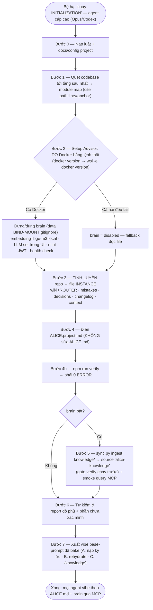

# INITIALIZATION.md — Quy trình bootstrap template vào một project

Khi template `knowledge/` được thả vào một project, Alice đọc file này rồi **đặc tả hoá** nó từ generic → specific. Đây là việc **một lần** (và chạy lại khi codebase đổi lớn).

> Alice: khi Bệ hạ nói *"chạy INITIALIZATION"*, thực hiện tuần tự các bước dưới. Không bỏ bước. Không báo xong khi chưa có bằng chứng.

> **Quan trọng từ v2 — không "cook" file template nữa.** Kết quả đặc tả ghi vào **file instance**: [`ALICE.project.md`](ALICE.project.md), [`wiki/ROUTER.md`](wiki/ROUTER.md), các trang `wiki/<module>.md`, `mistakes/LOG.md`, `decisions/LOG.md`, `changelog/`, `context/`. **Tuyệt đối không sửa** `ALICE.md`, `wiki/README.md`, `sub-agents/base-prompt.md` — đó là file template, [`tools/update.py`](tools/update.py) sẽ ghi đè chúng khi nâng cấp. Xem [`UPGRADE.md`](UPGRADE.md).

## Sơ đồ luồng chạy



## Nguyên tắc bất di (đọc trước, tuân suốt)

- **Không lười đọc.** Phải quét codebase tới **tầng sâu nhất** liên quan, không dừng ở thư mục gốc.
- **Không ảo giác.** Mọi khẳng định về code phải verify từ **source hiện tại** và **cite `path:line#anchor`** (có anchor, để `verify.py` bắt được khi code trôi).
- **Cái gì không chắc → ghi rõ "chưa xác minh"**, không bịa cho đủ.
- **Trung thực về độ phủ.** Nếu chưa đọc hết, nói rõ đã đọc tới đâu và phần nào còn bỏ ngỏ.
- **Dò môi trường THẬT, đừng đoán.** Kiểm Docker/agent/OS bằng lệnh thực — trên Windows PHẢI thử cả `wsl -e docker` (Docker CE trong WSL), **KHÔNG mặc định Docker Desktop**. Kiểm brain/LLM qua **SAG API** (`GET /system/capabilities` → `llm_configured`), **KHÔNG đọc `.env`** (LLM set trong UI lưu vào DB → `.env` trống vẫn đã cấu hình).
- **Tự chủ, hỏi ít.** Chỉ hỏi trước khi **cài/đổi cấu hình máy** hoặc cần **credential**. Bước 3–7 là nhiệm vụ → làm luôn, **không hỏi xác nhận từng bước**, và **không đứng chờ key**. **Tự sửa** context/wiki cũ khi mâu thuẫn hiện trạng thật — không hỏi.
- **Chỉ ghi vào file instance.** Xem khối cảnh báo đầu file.

## Bước 0 — Nạp luật & tài liệu sẵn có của project

1. Đọc [`ALICE.md`](ALICE.md) (hiến pháp) + `AGENTS.md`/`CLAUDE.md` của project (nếu có) + mọi `README`, `docs/`, `CONTRIBUTING`, ADR, spec.
2. Đọc config: `package.json`/`pyproject`/`go.mod`..., `.env.example`, `docker-compose*`, CI (`.github`, `.gitlab-ci.yml`), lint/format config.
3. Ghi lại **quy tắc project** phát hiện được (sẽ nhét vào `ALICE.project.md` ở Bước 4).

## Bước 1 — Quét codebase tới tầng sâu nhất

Mục tiêu: lập **module map** thật.

1. Xác định **entry points** (routes, main, server bootstrap, handlers, jobs, migrations).
2. Đi theo import/dependency để hiểu **data layer** (ORM/schema/model), **auth/permission**, **service/business logic**, **integration ngoài** (API, queue, storage, third-party).
3. Nhóm code thành **module** theo ranh giới tự nhiên (payment, booking, auth, sync...). Với mỗi module ghi: path chính (`path:line#anchor`), contract vào/ra, data model, phụ thuộc, vùng rủi ro.
4. Đọc `git log` (compact) để hiểu lịch sử & hotspot; đọc TODO/FIXME/known-issues.

**Không** claim đã hiểu module khi chưa mở file thật của nó.

## Bước 2 — Setup advisor (DYNAMIC — tư vấn Bệ hạ)

Mục tiêu: giúp Bệ hạ setup **đầy đủ nhất có thể**. Phải **dò hiện trạng trước**, rồi tư vấn, rồi (nếu Bệ hạ đồng ý) hướng dẫn từng bước và **test lại**.

### 2a. Dò sub-agents đang có
- Kiểm CLI/agent đã cài (`opencode --version`, `gemini --version`, `codex --version`, `claude` extension).
- Với opencode: `opencode auth list` + `opencode models` để biết provider/model thực có.
- Đối chiếu [model policy](sub-agents/models-and-fallback.md) và **ngưỡng delegate** ở [`sub-agents/README.md`](sub-agents/README.md).
- Nếu orchestrator là Claude Code: ghi rõ rằng sub-agent native **cùng hạng model → không rẻ hơn**, lợi ích là cô lập context. Đừng hứa tiết kiệm token nếu không có.

### 2b. Tư vấn cài thêm (chỉ khi Bệ hạ muốn)
- Nêu **lợi ích cụ thể** của việc thêm 1 agent phụ. Nếu Bệ hạ đồng ý → **hướng dẫn từng bước** → **chạy 1 smoke test thật** → báo pass/fail. Không báo "đã cài" khi chưa test.

### 2c. Tư vấn MCP (theo từng agent)
Xem [`sub-agents/mcp.md`](sub-agents/mcp.md). Với mỗi MCP đề xuất: nói rõ **dùng để làm gì**, cách thêm, và test kết nối sau khi thêm.

### 2d. Dựng "não" (brain) — mặc định BẬT, KHÔNG HỎI

Xem [`brain/README.md`](brain/README.md) + [`brain/SETUP.md`](brain/SETUP.md).

> **Cấm hỏi "có bật brain không".** "Chạy INITIALIZATION" = đã đồng ý bật brain. Bật hay tắt do
> **kết quả dò Docker** quyết định, không do Bệ hạ trả lời. Câu hỏi duy nhất được phép ở mục này:
> *"máy chưa có Docker, Bệ hạ có muốn nô tài hướng dẫn cài không?"* — và chỉ khi cả hai lệnh dò
> đều fail.

> **Cấm hỏi "project này nên dùng brain nào".** Luật đã cố định: **MỖI PROJECT MỘT BRAIN.**
> Thấy máy đã có brain của project khác đang chạy thì đó **không** phải brain của project này —
> cứ `npm run brain` trong project này, launcher tự cấp danh tính (`BRAIN_ID` suy từ đường dẫn
> kho tri thức) và cổng trống riêng. Không đụng brain đang chạy, không hỏi, không dùng chung.
> Muốn xem máy đang có brain nào: `npm run brain:list`.

- **Dò Docker cho ĐÚNG môi trường — KHÔNG mặc định Docker Desktop:**
  1. `docker version`.
  2. Windows mà (1) fail → **BẮT BUỘC thử tiếp** `wsl -e docker version` (Docker CE trong WSL — rất phổ biến).
  3. Chỉ kết luận "không có Docker" khi **cả hai đều fail**.
- **Luôn dùng `npm run brain`** — nó tự chọn launcher đúng môi trường (Docker Desktop / Docker CE trong WSL / mac / Linux). Đừng gọi thẳng `brain-up.ps1` hay `brain-up.sh`.
- **Brain chạy NỀN.** Dựng xong là trả terminal, kể cả trên WSL. Không có chuyện phải giữ cửa sổ mở. Tắt: `npm run brain:down`. Xem mọi brain trên máy: `npm run brain:list`.
- **Cổng không cố định.** Mỗi project được cấp cổng trống riêng (project đầu tiên thường vẫn là 3000/8000/8090). Lấy cổng thật từ `npm run brain:status`, **đừng giả định 3000**.
- **Dò trạng thái brain/LLM — hỏi chính SAG, KHÔNG đọc `.env`:** `GET /api/v1/system/capabilities` → `llm_configured`. Nếu `llm_configured=true` **hoặc** user nói đã test search → **LLM XONG rồi, đừng hỏi lại key.**
- **Thật sự không có Docker:** `brain = disabled`, fallback đọc file. Chỉ **hỏi trước khi CÀI** Docker — không tự cài.

> Chỉ **một** loại câu hỏi được phép trong toàn bộ INITIALIZATION: **cài phần mềm mới lên máy**
> (Docker, một CLI agent) hoặc **xin credential**. Mọi thứ khác — bật brain, dùng brain thế nào,
> ghi file nào, có nên sync không — **tự quyết theo tài liệu này**. Bước 3–7 **LÀM LUÔN**:
> "chạy INITIALIZATION" = đã đồng ý.

## Bước 3 — Tinh luyện repo → file instance

> **Đây là nơi "trí tuệ" được front-load.** Brain **chỉ embedding folder `knowledge/`** (không index source code), nên chất lượng distill ở đây quyết định recall khi vibe. Chủ động lần `git log`/PR/issue/TODO để rút bài học thật.

- **`wiki/<module>.md`**: mỗi module 1 file theo [`wiki/_TEMPLATE.md`](wiki/_TEMPLATE.md), citation dạng `path:line#anchor`. Giữ **tree-shaking** (mỗi trang tự chứa).
- **`wiki/ROUTER.md`**: điền bảng **Router** (vùng→trang) + **Dictionary** (thuật ngữ→trang). **Mỗi trang wiki phải có đúng 1 dòng ở đây**, nếu không `verify.py` báo trang mồ côi.
- **`mistakes/LOG.md`**: seed từ incident/TODO/known-issues/git đã phát hiện. Mỗi entry có ID `M-XXXX` + `Trạng thái` + đủ 6 phần. Chưa có gì thật thì **để trống — không bịa lỗi**.
- **`decisions/LOG.md`**: seed các luật bền phát hiện được từ repo (convention bắt buộc trong CONTRIBUTING, quyết định ghi trong ADR, ràng buộc nghiệp vụ trong comment). ID `D-XXXX`, **bắt buộc có Nguồn** (`file:line` hoặc lời Bệ hạ). Không suy diễn sở thích của Bệ hạ khi chưa nghe Bệ hạ nói.
- **`changelog/<module>.md`**: mỗi module 1 file; backfill **compact** vài mốc lớn từ `git log`.
- **`context/`**: tạo 1 digest khởi tạo (ngày, phạm vi đã quét, module map, quyết định init, phần bỏ ngỏ) + thêm dòng vào `INDEX.md`.
- **`sub-agents/`**: **không sửa** file nào ở đây (đều là template). Đặc thù project ghi vào `ALICE.project.md` mục 7.

## Bước 4 — Điền `ALICE.project.md`

Điền đủ 7 mục trong [`ALICE.project.md`](ALICE.project.md): tech stack & runtime · convention repo · module map · vùng high-risk · lệnh chạy/test/deploy **đã xác nhận** · vùng cấm · cấu hình sub-agent.

**Không sửa `ALICE.md`.** Nếu thấy hiến pháp thiếu gì cho project này, ghi vào `ALICE.project.md` — đó là chỗ dành cho nó.

## Bước 4b — Verify (gate bắt buộc)

```bash
npm run verify
```

Phải **0 ERROR** mới đi tiếp. Cái nó hay bắt lúc init: trang wiki chưa có trong `ROUTER.md`, citation thiếu `#anchor` hoặc trỏ sai dòng (`--fix` nắn được), entry `mistakes`/`decisions` thiếu trường.

Nếu Bệ hạ muốn bật kiểm phủ sóng code→wiki: tạo `tools/verify.config` với `CODE_ROOT` và `CODE_MODULE_DIRS`.

## Bước 5 — Ingest `knowledge/` vào não (nếu brain bật)

> **KHÔNG chặn cả INIT để chờ LLM key.** Bước 3/4/7 agent tự làm bằng model của mình — **không cần** LLM của SAG. Chỉ **ingest** mới cần LLM. Nếu SAG chưa có LLM key: làm xong 3/4/7 trước, rồi báo 1 lần: *"đặt LLM key ở Settings → Models rồi chạy `npm run sync`"* — coi ingest là next step, không đứng chờ.

Khi đã có LLM:
1. Copy `brain/brain.config.example` → `brain/brain.config`; điền API base + token/tên login + source `alice-knowledge`.
2. `npm run sync` → **tự chạy verify trước** (dừng nếu còn ERROR), rồi ingest **chỉ** folder `knowledge/`.
3. Đợi document **READY** → **smoke query** qua MCP (`list_sources`, `search`, `get_entity`): kết quả phải có evidence + trỏ về file thật.
4. Sửa thử 1 file rồi chạy lại sync → xác nhận **không tạo document trùng** (`list_documents`).
5. **Cắm brain vào agent — INIT TỰ LÀM.** Ghi cấu hình MCP **stdio-bridge** vào config của agent đang chạy INIT:
   - **Codex:** `[mcp_servers.brain]` trong `~/.codex/config.toml`.
   - **Claude Code:** `claude mcp add` (hoặc `.mcp.json` của project).
   - **opencode/Gemini:** mục MCP tương ứng.
   Lệnh bridge **lấy từ `npm run mcp`** — tên container mang `BRAIN_ID` riêng của project này, **đừng gõ tay `alice-brain-api-1`** (tên đó là của bản cũ, gõ tay sẽ cắm nhầm vào brain của project khác). Ghi xong → **nhắc Bệ hạ RESTART agent**.

**Không báo "não sẵn sàng" khi chưa smoke.**

## Bước 6 — Tự kiểm & report

- [ ] Đã đọc `ALICE.md` + tài liệu project + config.
- [ ] Module map dựng từ **source thật**, citation có `#anchor`; phần chưa chắc đã đánh dấu "chưa xác minh".
- [ ] `wiki/<module>.md` tạo xong, mỗi trang tự chứa; **`wiki/ROUTER.md` có đủ dòng cho từng trang**.
- [ ] `changelog/`, `context/` khởi tạo; `mistakes/` + `decisions/` seed thật (hoặc trống có chủ đích).
- [ ] **`ALICE.project.md` đã điền đủ 7 mục**, không còn `‹đặc tả khi init›` bỏ sót.
- [ ] **Không sửa file template nào** (`ALICE.md`, `wiki/README.md`, `sub-agents/*`, `brain/*.md`).
- [ ] **`npm run verify` → 0 ERROR.**
- [ ] Setup advisor đã chạy: nêu hiện trạng sub-agents/MCP + đề xuất; cái nào cài thì đã test.
- [ ] **Brain** (nếu bật): dựng + smoke query OK + sync lại **không trùng**; hoặc ghi rõ `brain = disabled` + fallback. `brain.config`/state/`.sag-data` đã gitignore.
- [ ] Đã nhắc Bệ hạ: **xoá `knowledge/.git`** (nếu clone) và **commit `knowledge/` vào repo project** — từ v2 nâng cấp đi qua `tools/update.py`, không qua `git pull`.
- [ ] **Không bịa**: mọi khẳng định có nguồn.

Report theo format ở `ALICE.md` mục 8.

## Bước 7 — Bàn giao: xuất User Base Prompt (vibe) cho project

Việc **cuối cùng**: sinh cho Bệ hạ **1 base prompt vibe ĐÃ BAKE hoàn chỉnh cho project này**. Nguyên tắc: mọi thứ **đã điền sẵn** — **Bệ hạ CHỈ cần gõ task ở `## NHIỆM VỤ`**.

Thay `<PROJECT>` bằng tên project thật, in ra trong report, và lưu vào `prompts.md` **của chính project này**. Khung:

```
Bạn là Alice, làm theo knowledge/ALICE.md + knowledge/ALICE.project.md trên project <PROJECT>.

[A] Trước khi làm (bắt buộc): brain bật → NẠP KÝ ỨC qua MCP theo knowledge/brain/RETRIEVAL.md
    (search/grep đa góc + get_entity, đạt tiêu chí dừng), in checklist "ký ức đã nạp" kèm
    số tool call + citation. Brain offline → đọc knowledge/mistakes/LOG.md (phân tầng theo tag)
    + TOÀN BỘ knowledge/decisions/LOG.md ACTIVE + knowledge/wiki/ROUTER.md (trang khớp)
    + context digest gần nhất.

[B] Sau auto-compact/thấy mơ hồ: re-query não + đọc lại rules + decisions + context digest
    gần nhất (ALICE mục 9b).

[C] Trong lúc làm — ghi theo TURN, không đợi cuối task (ALICE mục 9a):
    Bệ hạ nêu sở thích/chốt hướng/bác hướng/luật nghiệp vụ → ghi ngay D-XXXX vào
    knowledge/decisions/LOG.md. Vấp lỗi/giả định sai → ghi ngay M-XXXX vào mistakes/LOG.md.

[D] Kết thúc: chạy routine knowledge/brain/KNOWLEDGE.md — distill → PRUNE (gộp trùng,
    đánh SUPERSEDED) → `npm run verify` (phải 0 ERROR) →
    `npm run sync`. Report theo ALICE mục 8 (có mục "tri thức đã ghi").

## NHIỆM VỤ
<Bệ hạ chỉ cần điền việc cần làm ở đây>
```

Nhắc Bệ hạ: khi cần delegate, orchestrator dùng [base prompt gọi sub-agent](sub-agents/base-prompt.md), lấy slot cố định từ `ALICE.project.md`. Nếu muốn cả team dùng chung prompt vibe, track `prompts.md` trong repo project.
