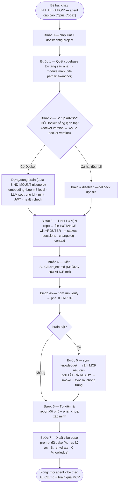

# INITIALIZATION.md — Quy trình bootstrap template vào một project

Khi template `knowledge/` được thả vào một project, Alice đọc file này rồi **đặc tả hoá** nó từ generic → specific. Đây là việc **một lần** (và chạy lại khi codebase đổi lớn).

> Alice: khi Bệ hạ nói *"chạy INITIALIZATION"*, thực hiện tuần tự các bước dưới. Không bỏ bước. Không báo xong khi chưa có bằng chứng.

> **Quan trọng từ v2 — không "cook" file template nữa.** Kết quả đặc tả ghi vào **file instance**: [`ALICE.project.md`](ALICE.project.md), [`wiki/ROUTER.md`](wiki/ROUTER.md), các trang `wiki/<module>.md`, `mistakes/LOG.md`, `decisions/LOG.md`, `changelog/`, `context/`. **Tuyệt đối không sửa** `ALICE.md`, `wiki/README.md`, `sub-agents/base-prompt.md` — đó là file template, [`tools/update.py`](tools/update.py) sẽ ghi đè chúng khi nâng cấp. Xem [`UPGRADE.md`](UPGRADE.md).

## Sơ đồ luồng chạy



## Nguyên tắc bất di (đọc trước, tuân suốt)

- **Đọc sâu nhất có thể — đây là tiêu chí số một của INITIALIZATION.** Không lướt, không suy từ
  tên file, không dừng ở thư mục gốc. Chuẩn "đủ sâu" được định nghĩa bằng số đo ở Bước 1, và
  phải báo cáo bằng con số ở Bước 6. INITIALIZATION là **lần duy nhất** agent được phép tiêu
  nhiều token để đọc cả repo; mọi phiên vibe sau đó sống bằng những gì tinh luyện được ở đây.
  Đọc thiếu ở bước này không lộ ra ngay — nó lộ ra hàng tháng sau, dưới dạng agent trả lời sai
  vì kho tri thức không có mục đó.
- **Không ảo giác.** Mọi khẳng định về code phải verify từ **source hiện tại** và **cite `path:line#anchor`** (có anchor, để `verify.py` bắt được khi code trôi).
- **Cái gì không chắc → ghi rõ "chưa xác minh"**, không bịa cho đủ.
- **Trung thực về độ phủ.** Nếu chưa đọc hết, nói rõ đã đọc tới đâu và phần nào còn bỏ ngỏ.
- **Dò môi trường THẬT, đừng đoán.** Kiểm Docker/agent/OS bằng lệnh thực — trên Windows PHẢI thử cả `wsl -e docker` (Docker CE trong WSL), **KHÔNG mặc định Docker Desktop**. Kiểm brain/LLM qua **SAG API** (`GET /system/capabilities` → `llm_configured`), **KHÔNG đọc `.env`** (LLM set trong UI lưu vào DB → `.env` trống vẫn đã cấu hình).
- **Tự chủ, hỏi ít.** Chỉ hỏi trước khi **cài/đổi cấu hình máy** hoặc cần **credential**. Bước 3–7 là nhiệm vụ → làm luôn, **không hỏi xác nhận từng bước**, và **không đứng chờ key**. **Tự sửa** context/wiki cũ khi mâu thuẫn hiện trạng thật — không hỏi.
- **Chỉ ghi vào file instance.** Xem khối cảnh báo đầu file.

## Bước 0 — Nạp luật & tài liệu sẵn có của project

1. Đọc [`ALICE.md`](ALICE.md) (hiến pháp) + `AGENTS.md`/`CLAUDE.md` của project (nếu có) + mọi `README`, `docs/`, `CONTRIBUTING`, ADR, spec.
2. Đọc config: `package.json`/`pyproject`/`go.mod`..., `.env.example`, `docker-compose*`, CI (`.github`, `.gitlab-ci.yml`), lint/format config.
3. Ghi lại **quy tắc project** phát hiện được (sẽ nhét vào `ALICE.project.md` ở Bước 4).

## Bước 1 — Quét codebase tới tầng sâu nhất

Mục tiêu: lập **module map** thật, và **không bỏ sót** tính năng · luật · workflow · ghi chú nào.

Làm theo **bốn lượt**, không nhảy cóc. Lượt sau chỉ bắt đầu khi lượt trước đã có danh sách.

### Lượt 1 — Kiểm kê (biết mình phải đọc bao nhiêu)

Liệt kê **toàn bộ** file của repo (trừ `node_modules`, `dist`, `.git`, lockfile, asset nhị phân),
phân loại thành: source · test · config/hạ tầng · tài liệu · script/CI · dữ liệu mẫu.
Ghi lại **tổng số file từng nhóm** — đây là mẫu số của báo cáo độ phủ ở Bước 6. Chưa có con số
này thì mọi câu "đã đọc kỹ" đều là cảm tính.

### Lượt 2 — Bổ dọc từng tính năng (đây là chỗ "sâu")

Với **mỗi tính năng người dùng thấy được**, đi hết chiều dọc, mở **file thật** ở từng tầng:

```
entry (route/CLI/job/event) → validation/auth → service/business logic
   → data (query/ORM/migration) → side effect (queue/mail/webhook/storage)
   → response/UI → test đang bảo vệ nó
```

Mỗi tầng ghi lại `path:line#anchor`. **Không** claim đã hiểu một tính năng khi còn tầng chưa mở.
Không suy diễn hành vi từ tên hàm — đọc thân hàm. Gặp nhánh `if/else` mang luật nghiệp vụ, gặp
`try/except` nuốt lỗi, gặp giá trị hard-code: ghi lại, đó chính là loại tri thức không có trong
tài liệu nào.

### Lượt 3 — Quét luật · workflow · ghi chú (không tính năng nào chứa những thứ này)

Đọc **hết**, mỗi loại một lượt riêng:

| Loại | Nơi tìm | Tinh luyện thành |
|---|---|---|
| **Luật** (rules) | `AGENTS.md`/`CLAUDE.md`/`.cursorrules`, CONTRIBUTING, lint/format/tsconfig/ruff, pre-commit hook, CODEOWNERS, ADR | `decisions/` (`D-XXXX`, bắt buộc có Nguồn) hoặc `ALICE.project.md` |
| **Workflow** | script trong `package.json`/`Makefile`/`justfile`, CI (`.github/workflows`, `.gitlab-ci.yml`), Dockerfile/compose, script deploy/migrate/seed | trang `wiki/` riêng cho vận hành + mục 5 của `ALICE.project.md` |
| **Ghi chú** (notes) | README các cấp, `docs/`, comment dài đầu file, TODO/FIXME/HACK/XXX, issue template, changelog cũ, `.env.example` | `wiki/` trang tương ứng; ghi chú về bẫy → `mistakes/` |
| **Lịch sử** | `git log` compact, message của commit revert/hotfix, file bị sửa nhiều nhất | hotspot + `mistakes/` (chỉ khi có bằng chứng thật) |

Mỗi mục đọc được phải đi tới **một dòng trong kho tri thức**, hoặc bị loại có lý do. Đọc rồi
không ghi gì = coi như chưa đọc, vì phiên vibe sau không thấy được nó.

### Lượt 4 — Gom thành module

Nhóm code theo ranh giới tự nhiên (payment, booking, auth, sync…). Mỗi module ghi: path chính
(`path:line#anchor`), contract vào/ra, data model, phụ thuộc, vùng rủi ro, test bao phủ tới đâu.

### Sổ độ phủ (bắt buộc)

Vừa đọc vừa giữ một sổ: **file đã đọc / tổng file** theo nhóm, **tính năng đã bổ dọc trọn vẹn**,
và danh sách **phần cố ý bỏ qua kèm lý do**. Bước 6 sẽ hỏi đúng ba con số này. Không được làm
tròn lên, không được ghi "đã đọc toàn bộ" khi chỉ mới đọc phần liên quan.

## Bước 2 — Setup advisor (DYNAMIC — tư vấn Bệ hạ)

Mục tiêu: giúp Bệ hạ setup **đầy đủ nhất có thể**. Phải **dò hiện trạng trước**, rồi tư vấn, rồi (nếu Bệ hạ đồng ý) hướng dẫn từng bước và **test lại**.

### 2a. Dò sub-agents đang có
- Chỉ kiểm CLI/agent đã cài (`opencode --version`, `gemini --version`, `codex --version`,
  `claude` extension) để biết **khả năng sửa filesystem trên host**.
- **Không** dùng kết quả CLI để suy ra registry của ALICE có/rỗng, và không đoán endpoint REST.
  Nguồn sự thật registry chỉ được đọc sau khi brain chạy ở Bước 2e.
- Đối chiếu **ngưỡng delegate** ở [`sub-agents/README.md`](sub-agents/README.md). Provider/model
  không lấy từ bảng tĩnh trong repo; sau khi brain chạy, chốt registry ở Bước 2e.
- Nếu orchestrator là Claude Code: ghi rõ rằng sub-agent native **cùng hạng model → không rẻ hơn**, lợi ích là cô lập context. Đừng hứa tiết kiệm token nếu không có.

### 2b. Tư vấn cài thêm (chỉ khi Bệ hạ muốn)
- Nêu **lợi ích cụ thể** của việc thêm 1 agent phụ. Nếu Bệ hạ đồng ý → **hướng dẫn từng bước** → **chạy 1 smoke test thật** → báo pass/fail. Không báo "đã cài" khi chưa test.

### 2c. Tư vấn MCP (theo từng agent)
Xem [`sub-agents/mcp.md`](sub-agents/mcp.md). MCP là capability tùy chọn (browser/docs/DB), **không
phải nguồn cấu hình provider/model sub-agent**. Với mỗi MCP đề xuất: nói rõ dùng để làm gì, cách thêm,
và test kết nối sau khi thêm.

### 2d. Dựng "não" (brain) — mặc định BẬT, KHÔNG HỎI

Xem [`brain/README.md`](brain/README.md) + [`brain/SETUP.md`](brain/SETUP.md).

> **Cấm hỏi "có bật brain không".** "Chạy INITIALIZATION" = đã đồng ý bật brain. Bật hay tắt do
> **kết quả dò Docker** quyết định, không do Bệ hạ trả lời. Câu hỏi duy nhất được phép ở mục này:
> *"máy chưa có Docker, Bệ hạ có muốn nô tài hướng dẫn cài không?"* — và chỉ khi cả hai lệnh dò
> đều fail.

> **Cấm hỏi "project này nên dùng brain nào".** Luật đã cố định: **MỖI PROJECT MỘT BRAIN.**
> Thấy máy đã có brain của project khác đang chạy thì đó **không** phải brain của project này —
> cứ `npm run brain` trong project này, launcher tự cấp danh tính (`BRAIN_ID` suy từ đường dẫn
> kho tri thức) và cổng trống riêng. Không đụng brain đang chạy, không hỏi, không dùng chung.
> Muốn xem máy đang có brain nào: `npm run brain:list`.

- **Dò Docker cho ĐÚNG môi trường — KHÔNG mặc định Docker Desktop:**
  1. `docker version`.
  2. Windows mà (1) fail → **BẮT BUỘC thử tiếp** `wsl -e docker version` (Docker CE trong WSL — rất phổ biến).
  3. Chỉ kết luận "không có Docker" khi **cả hai đều fail**.
- **Luôn dùng `npm run brain`** — nó tự chọn launcher đúng môi trường (Docker Desktop / Docker CE trong WSL / mac / Linux). Đừng gọi thẳng `brain-up.ps1` hay `brain-up.sh`.
- **Brain chạy NỀN.** Dựng xong là trả terminal, kể cả trên WSL. Không có chuyện phải giữ cửa sổ mở. Tắt: `npm run brain:down`. Xem mọi brain trên máy: `npm run brain:list`.
- **Cổng không cố định.** Mỗi project được cấp cổng trống riêng (project đầu tiên thường vẫn là 3000/8000). Lấy cổng thật từ `npm run brain:status`, **đừng giả định 3000**.
- **Dò trạng thái brain/LLM — hỏi chính SAG, KHÔNG đọc `.env`:** `GET /api/v1/system/capabilities` → `llm_configured`. Nếu `llm_configured=true` **hoặc** user nói đã test search → **LLM XONG rồi, đừng hỏi lại key.**
- **Thật sự không có Docker:** `brain = disabled`, fallback đọc file. Chỉ **hỏi trước khi CÀI** Docker — không tự cài.

> Chỉ **một** loại câu hỏi được phép trong toàn bộ INITIALIZATION: **cài phần mềm mới lên máy**
> (Docker, một CLI agent) hoặc **xin credential**. Mọi thứ khác — bật brain, dùng brain thế nào,
> ghi file nào, có nên sync không — **tự quyết theo tài liệu này**. Bước 3–7 **LÀM LUÔN**:
> "chạy INITIALIZATION" = đã đồng ý.

### 2e. Chốt registry Sub Agents trên brain

Nguồn sự thật là **Settings → Sub Agents** trên brain vừa dựng. Agent đọc bằng tool MCP
`list_sub_agents`; UI là chỗ Bệ hạ cấu hình. **Cấm đoán đường dẫn API rồi lấy loạt 404 làm bằng
chứng registry rỗng.**

- Năm preset `Claude`, `Codex`, `OpenCode GO`, `OpenCode ZEN`, `Gemini CLI` **không có bảng model
  hard-code**. Phải nhập API key (hoặc dùng key đã lưu), bấm xác thực và lấy danh sách model trực
  tiếp từ provider; chỉ `Custom provider` được nhập model thủ công.
- Registry độc lập với MCP capability của từng CLI, nhưng chính MCP brain cung cấp hai tool chuẩn:
  `list_sub_agents` để đọc registry và `ask_sub_agent` để gọi model đã bật.
- Credential mã hoá bằng secret của brain; API chỉ trả `credential_set`, không trả key. Slot preset
  chỉ được bật/lưu với model còn nằm trong danh sách live và có `model_verified=true`. **Không**
  chép credential vào file project, prompt, task spec, log hay report.
- Nếu Bệ hạ **yêu cầu cấu hình sub-agent trong INITIALIZATION**, Alice mở tab này và cấu hình slot
  được yêu cầu. Chỉ hỏi phần credential còn thiếu; không hỏi lại provider/model đã được Bệ hạ chốt.
- Nếu Bệ hạ không yêu cầu, gọi `list_sub_agents`, chỉ lấy slot `callable=yes`; registry rỗng không
  chặn INITIALIZATION.
- Smoke mỗi slot cần dùng bằng `ask_sub_agent` với một task ngắn. Credential được giải mã và dùng
  **bên trong Brain**; tool không trả key, không cần chép lại thành biến môi trường trên host.
- Nếu muốn sub-agent **tự đọc/sửa file**, đó là đường CLI riêng: lúc ấy mới cần CLI có thật, auth
  riêng hợp lệ và smoke CLI. Ghi vào `ALICE.project.md` **provider + model + vai trò + execution
  mode (`brain` hoặc `host-cli`) + lệnh verify**, tuyệt đối không ghi credential.

> **Ranh giới thật:** `ask_sub_agent` gọi model qua provider để phân tích/review và tự ghi
> telemetry, nhưng model đó **không có filesystem hay MCP brain**. Orchestrator phải truyền code,
> diff và tri thức liên quan trong `context`, rồi tự áp dụng/review kết quả. Muốn giao hẳn việc sửa
> file thì dùng `host-cli`; Brain không rót credential đã lưu vào CLI. Chi tiết ở
> [`sub-agents/models-and-fallback.md`](sub-agents/models-and-fallback.md).

## Bước 3 — Tinh luyện repo → file instance

> **Đây là nơi "trí tuệ" được front-load.** Brain **chỉ embedding folder `knowledge/`** (không index source code), nên chất lượng distill ở đây quyết định recall khi vibe. Chủ động lần `git log`/PR/issue/TODO để rút bài học thật.

> **Tinh luyện càng nhiều càng tốt — nhưng là "nhiều tri thức", không phải "nhiều chữ".** Thước
> đo: một agent chưa từng thấy repo này, chỉ đọc `knowledge/`, có trả lời được không. Vì vậy mỗi
> trang phải có thứ **không đoán được từ tên file**: bất biến, contract chính xác, thứ tự bắt
> buộc, chế độ hỏng, và bẫy. Chép lại chữ ký hàm thì vô dụng — source code đã có sẵn.
>
> Với **mỗi module**, tối thiểu phải trả lời được: nó nhận gì / trả gì (kiểu dữ liệu thật) ·
> ai được gọi và với quyền nào · dữ liệu nằm ở bảng/collection nào · thao tác nào **không**
> idempotent · lỗi thì hỏng tới đâu · chỗ nào từng vỡ trong `git log` · lệnh nào verify được nó.
> Thiếu mục nào thì ghi "chưa xác minh" ở đúng mục đó, đừng bỏ trống lặng lẽ.

- **`wiki/<module>.md`**: mỗi module 1 file theo [`wiki/_TEMPLATE.md`](wiki/_TEMPLATE.md), citation dạng `path:line#anchor`. Giữ **tree-shaking** (mỗi trang tự chứa).
- **`wiki/<workflow>.md`**: build · test · migrate · deploy · release · seed dữ liệu — mỗi luồng vận hành một trang, ghi **lệnh thật đã chạy được**, thứ tự bước, và dấu hiệu hỏng. Đây là phần agent hay bịa nhất nếu không có tài liệu.
- **`wiki/ROUTER.md`**: điền bảng **Router** (vùng→trang) + **Dictionary** (thuật ngữ→trang). **Mỗi trang wiki phải có đúng 1 dòng ở đây**, nếu không `verify.py` báo trang mồ côi.
- **`mistakes/LOG.md`**: seed từ incident/TODO/known-issues/git đã phát hiện. Mỗi entry có ID `M-XXXX` + `Trạng thái` + đủ 6 phần. Chưa có gì thật thì **để trống — không bịa lỗi**.
- **`decisions/LOG.md`**: seed các luật bền phát hiện được từ repo (convention bắt buộc trong CONTRIBUTING, quyết định ghi trong ADR, ràng buộc nghiệp vụ trong comment). ID `D-XXXX`, **bắt buộc có Nguồn** (`file:line` hoặc lời Bệ hạ). Không suy diễn sở thích của Bệ hạ khi chưa nghe Bệ hạ nói.
- **`changelog/<module>.md`**: mỗi module 1 file; backfill **compact** vài mốc lớn từ `git log`.
- **`context/`**: tạo 1 digest khởi tạo (ngày, phạm vi đã quét, module map, quyết định init, phần bỏ ngỏ) + thêm dòng vào `INDEX.md`.
- **`sub-agents/`**: **không sửa** file nào ở đây (đều là template). Đặc thù project ghi vào `ALICE.project.md` mục 7.

## Bước 4 — Điền `ALICE.project.md`

Điền đủ 7 mục trong [`ALICE.project.md`](ALICE.project.md): tech stack & runtime · convention repo · module map · vùng high-risk · lệnh chạy/test/deploy **đã xác nhận** · vùng cấm · cấu hình sub-agent.

**Không sửa `ALICE.md`.** Nếu thấy hiến pháp thiếu gì cho project này, ghi vào `ALICE.project.md` — đó là chỗ dành cho nó.

## Bước 4b — Verify (gate bắt buộc)

```bash
npm run verify
```

Phải **0 ERROR** mới đi tiếp. Cái nó hay bắt lúc init: trang wiki chưa có trong `ROUTER.md`, citation thiếu `#anchor` hoặc trỏ sai dòng (`--fix` nắn được), entry `mistakes`/`decisions` thiếu trường.

Nếu Bệ hạ muốn bật kiểm phủ sóng code→wiki: tạo `tools/verify.config` với `CODE_ROOT` và `CODE_MODULE_DIRS`.

## Bước 5 — Ingest `knowledge/` vào não (nếu brain bật)

> **KHÔNG chặn cả INIT để chờ LLM key.** Bước 3/4/7 agent tự làm bằng model của mình — **không cần** LLM của SAG. Chỉ **ingest** mới cần LLM. Nếu SAG chưa có LLM key: làm xong 3/4/7 trước, rồi báo 1 lần: *"đặt LLM key ở Settings → Models rồi chạy `npm run sync`"* — coi ingest là next step, không đứng chờ.

> **`npm run sync` trả về không có nghĩa extraction đã xong.** Lệnh chỉ đã gửi ingest; pipeline còn
> chạy nền qua `pending/loading/extracting` rồi mới tới `ready`. Search có thể thấy index từng phần
> trước lúc đó, nên search ra kết quả sớm **không phải** bằng chứng brain đã sẵn sàng.

Khi đã có LLM:
1. Copy `brain/brain.config.example` → `brain/brain.config`; chỉ điền token/tên login nếu cần.
   API port và source name tự lấy theo brain của project (`<BRAIN_ID>-knowledge`), không gõ tay.
2. `npm run sync` → **tự chạy verify trước** (dừng nếu còn ERROR), rồi ingest **chỉ** folder `knowledge/`.
3. **Cắm brain vào agent — INIT TỰ LÀM, trước khi smoke.** Nếu MCP `brain` đã có trong phiên thì dùng
   thẳng. Nếu chưa có, ghi cấu hình MCP **stdio-bridge** vào config của agent đang chạy INIT:
   - **Codex:** `[mcp_servers.brain]` trong `~/.codex/config.toml`.
   - **Claude Code:** `claude mcp add` (hoặc `.mcp.json` của project).
   - **opencode/Gemini:** mục MCP tương ứng.
   Lệnh bridge **lấy từ `npm run mcp`** — tên container mang `BRAIN_ID` riêng của project này, **đừng gõ tay `alice-brain-api-1`** (tên đó là của bản cũ, gõ tay sẽ cắm nhầm vào brain của project khác). Ghi xong → **nhắc Bệ hạ RESTART agent**.
   **`npm run mcp` là lệnh của agent, không phải của Bệ hạ** — đừng bao giờ đưa nó vào next step
   cho Bệ hạ. Bệ hạ chỉ biết `npm run brain` (khi cần vibe) và `npm run update` (khi cần bản mới).
   MCP đã cắm sẵn từ bản cũ nhưng thiếu `-e SAG_MCP_ACTOR=…`? Agent **tự cập nhật lại config** rồi
   nhắc restart — không hỏi, không giao việc đó cho Bệ hạ.
   Restart là blocker thật duy nhất ở đoạn này. Sau restart, tiếp tục đúng Bước 5; **không chạy lại
   INITIALIZATION từ đầu** và không dùng curl để thay cho smoke MCP.
4. Qua MCP `list_sources` + `list_documents`, đối chiếu đúng source `<BRAIN_ID>-knowledge` và đủ
   số file vừa ingest. Poll
   tới khi **TẤT CẢ document của source đều `ready`**:
   - `pending/loading/extracting` = còn chạy → tiếp tục theo dõi trong cùng lượt; có thể làm Bước 7
     trong lúc chờ nhưng **không kết thúc lượt** chỉ để báo tiến độ.
   - `failed/paused` = **FAIL**, đọc log và xử lý; không được nói "sẽ tự hoàn tất".
   - Nếu cần cập nhật tiến độ vì chờ lâu, nói ngắn trạng thái rồi **tiếp tục làm**, không phát báo
     cáo kết thúc và không nói "đã chạy đủ 7 bước".
5. Chỉ sau khi tất cả `ready`, **smoke query qua MCP**:
   - `search` một câu hỏi có dữ kiện đặc trưng của project → phải trả evidence đúng và citation trỏ
     về file instance thật.
   - `get_entity` một thực thể đã biết có trong tri thức vừa ingest → phải trả context đúng từ source
     này. Kết quả trên graph đang extract dở không tính là pass.
6. Ghi kết quả smoke thật vào digest khởi tạo trong `context/`, rồi chạy lại `npm run sync`. Đây là
   phép thử đường **update**: `list_documents` phải cho thấy số document không tăng do file cũ bị
   nhân đôi, và document vừa cập nhật phải trở lại `ready`. "Lần ingest đầu chưa thấy trùng" **không
   phải** bằng chứng chống trùng.

**Không báo "não sẵn sàng" khi chưa smoke.**

## Bước 6 — Tự kiểm & report

- [ ] **Báo cáo độ phủ bằng SỐ** (sổ ở Bước 1): file đã đọc / tổng file theo nhóm · số tính năng
      đã bổ dọc trọn vẹn / tổng số tính năng · số file luật · workflow · ghi chú đã quét. Kèm danh
      sách **phần chưa đọc và vì sao**. Báo cáo không có ba con số này là **chưa xong Bước 6**.
- [ ] Đã đọc `ALICE.md` + tài liệu project + config.
- [ ] Module map dựng từ **source thật**, citation có `#anchor`; phần chưa chắc đã đánh dấu "chưa xác minh".
- [ ] `wiki/<module>.md` tạo xong, mỗi trang tự chứa; **`wiki/ROUTER.md` có đủ dòng cho từng trang**.
- [ ] `changelog/`, `context/` khởi tạo; `mistakes/` + `decisions/` seed thật (hoặc trống có chủ đích).
- [ ] **`ALICE.project.md` đã điền đủ 7 mục**, không còn `‹đặc tả khi init›` bỏ sót.
- [ ] **Không sửa file template nào** (`ALICE.md`, `wiki/README.md`, `sub-agents/*`, `brain/*.md`).
- [ ] **`npm run verify` → 0 ERROR.**
- [ ] Setup advisor đã chạy: `list_sub_agents` đọc đúng registry; slot mode `brain` đã smoke bằng
      `ask_sub_agent`; slot mode `host-cli` đã smoke bằng CLI thật; không suy registry từ CLI.
- [ ] **Brain** (nếu bật): đúng source + **tất cả document `ready`**, không có `failed/paused`; smoke
      `search` + `get_entity` chạy **sau READY**; sync một file đã đổi và xác nhận số document không
      tăng do trùng. Hoặc ghi rõ `brain = disabled` + fallback. `brain.config`/state/`.sag-data` đã gitignore.
- [ ] Đã nhắc Bệ hạ: **xoá `knowledge/.git`** (nếu clone) và **commit `knowledge/` vào repo project** — từ v2 nâng cấp đi qua `tools/update.py`, không qua `git pull`.
- [ ] **Không bịa**: mọi khẳng định có nguồn.

Report theo format ở `ALICE.md` mục 8.

Chỉ được ghi **INITIALIZATION PASS / đã chạy đủ 7 bước** khi toàn bộ checklist trên đạt. Extraction
còn chạy là **IN PROGRESS**, không phải risk hậu kiểm và không phải việc "không cần ai làm gì":
agent đang INIT vẫn phải theo dõi tới trạng thái cuối. Chỉ dừng cho Bệ hạ khi cần restart agent,
credential, cài phần mềm, hoặc gặp lỗi thật không thể tự xử lý.

## Bước 7 — Bàn giao: xuất User Base Prompt (vibe) cho project

Việc **cuối cùng**: sinh cho Bệ hạ **1 base prompt vibe ĐÃ BAKE hoàn chỉnh cho project này**. Nguyên tắc: mọi thứ **đã điền sẵn** — **Bệ hạ CHỈ cần gõ task ở `## NHIỆM VỤ`**.

Thay `<PROJECT>` bằng tên project thật, in ra trong report, và lưu vào `prompts.md` **của chính project này**. Khung:

```
Bạn là Alice, làm theo knowledge/ALICE.md + knowledge/ALICE.project.md trên project <PROJECT>.

[A] Trước khi làm (bắt buộc): brain bật → NẠP KÝ ỨC qua MCP theo knowledge/brain/RETRIEVAL.md
    (search/grep đa góc + get_entity, đạt tiêu chí dừng), in checklist "ký ức đã nạp" kèm
    số tool call + citation. Brain offline → đọc knowledge/mistakes/LOG.md (phân tầng theo tag)
    + TOÀN BỘ knowledge/decisions/LOG.md ACTIVE + knowledge/wiki/ROUTER.md (trang khớp)
    + context digest gần nhất.

[B] Sau auto-compact/thấy mơ hồ: re-query não + đọc lại rules + decisions + context digest
    gần nhất (ALICE mục 9b).

[C] Trong lúc làm — ghi theo TURN, không đợi cuối task (ALICE mục 9a):
    Bệ hạ nêu sở thích/chốt hướng/bác hướng/luật nghiệp vụ → ghi ngay D-XXXX vào
    knowledge/decisions/LOG.md. Vấp lỗi/giả định sai → ghi ngay M-XXXX vào mistakes/LOG.md.

[D] Kết thúc: chạy routine knowledge/brain/KNOWLEDGE.md — distill → PRUNE (gộp trùng,
    đánh SUPERSEDED) → `npm run verify` (phải 0 ERROR) →
    `npm run sync`. Report theo ALICE mục 8 (có mục "tri thức đã ghi").

[E] Giao việc cho sub-agent (nếu có): gọi `list_sub_agents`, đối chiếu policy ở
    knowledge/ALICE.project.md mục 7. Phân tích/review → `ask_sub_agent` với code + tri thức
    liên quan trong context; Brain tự ghi telemetry. Tự đọc/sửa file → host CLI qua
    knowledge/sub-agents/base-prompt.md, rồi khai bằng `log_agent_task`.

## NHIỆM VỤ
<Bệ hạ chỉ cần điền việc cần làm ở đây>
```

Nhắc Bệ hạ: khi cần delegate, orchestrator dùng [base prompt gọi sub-agent](sub-agents/base-prompt.md), lấy slot cố định từ `ALICE.project.md`. Nếu muốn cả team dùng chung prompt vibe, track `prompts.md` trong repo project.
