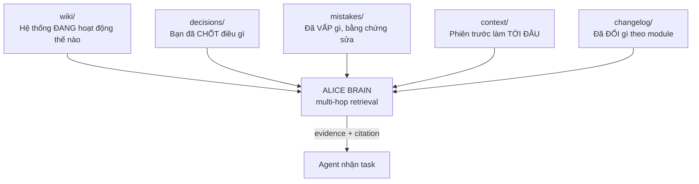
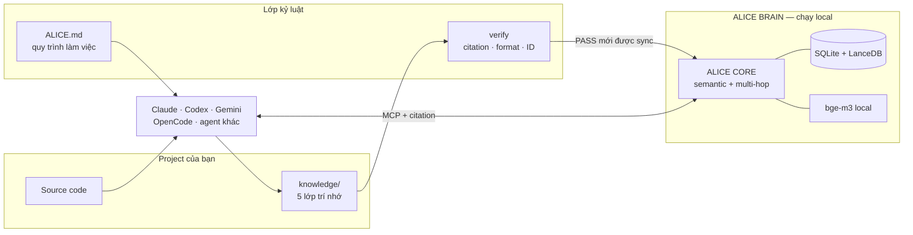

<div align="center">


# ALICE CODING

### Một bộ não đơn giản biến Agent thành một người cộng sự tuyệt vời.

**Một sản phẩm của [Blueberry Sensei](https://github.com/blueberry-sensei).**

[](LICENSE)
[](VERSION)
[](#alice-core-khác-rag-thường-ở-đâu)
[](https://huggingface.co/BAAI/bge-m3)
[](#4-cài-đặt-trong-10-phút)
[](#4-cài-đặt-trong-10-phút)

**[Vấn đề](#1-vấn-đề)** ·
**[Năm lớp trí nhớ](#2-năm-lớp-trí-nhớ-của-project)** ·
**[Bên trong](#3-bên-trong)** ·
**[Cài đặt](#4-cài-đặt-trong-10-phút)** ·
**[Vibe hằng ngày](#5-vibe-hằng-ngày)** ·
**[Bảng lệnh](#6-bảng-lệnh)**

</div>

---

**Alice Coding là lớp trí nhớ và kỷ luật đặt xung quanh coding agent bạn đang dùng.**
Không phải model mới, không thay thế Claude Code, Codex, Gemini CLI hay OpenCode. Nó cho chúng
ba thứ chúng không tự có: **trí nhớ thuộc về project**, **một quy trình bị máy ép phải theo**, và
**một bộ não tìm đúng ký ức khi cần** — tất cả chạy local trên máy bạn.

---

## 1. Vấn đề

Vibe coding nhanh ở ngày đầu và mục dần từ tuần thứ ba. Không phải vì model kém — vì **thứ model
cần biết chưa bao giờ được ghi lại**.

| Bạn thấy | Thiếu cái gì | Alice trả lời bằng |
|---|---|---|
| “Sao nó hỏi lại câu này nữa?” | Ký ức chỉ nằm trong chat cũ | `decisions/` + brain nạp đầu mỗi task |
| “Hôm qua sửa rồi, hôm nay lại phá.” | Không có sổ lỗi dùng chung | `mistakes/` với nguyên nhân và bằng chứng |
| “Nó bịa contract không có thật.” | Đọc tài liệu cũ thay vì source | Luật bắt xác nhận contract từ code đang chạy |
| “Prompt dài kinh khủng mà vẫn sót.” | Nạp nhiều chữ ≠ nạp đúng bằng chứng | Multi-hop retrieval trả evidence kèm citation |
| “Nó bảo xong, chạy thật thì chết.” | Không có gate ngoài context | `verify` chặn `sync`; agent không tự bỏ qua được |
| “Đổi agent là mất trí nhớ.” | Mỗi agent một nguồn sự thật | Một brain, mọi agent nói MCP đều tra được |
| “Auto-compact xong nó quên luật.” | Luật nằm trong context nên bị nén mất | Hook `SessionStart` nạp lại luật từ **ngoài** model |

Đổi sang model to hơn chỉ giúp nó **suy luận tốt hơn với thứ nó đang thấy**. Nó không thể nhớ một
quyết định chưa từng được ghi, và không thể kiểm chứng một điều chưa từng được lưu.

---

## 2. Năm lớp trí nhớ của project

Đây là phần cốt lõi. Trí nhớ không phải một đống ghi chú — nó được tách thành **năm lớp, mỗi lớp
trả lời đúng một câu hỏi**, có format riêng, vòng đời riêng và cách dọn rác riêng.



| Lớp | Trả lời câu hỏi | Ghi khi nào | Chống phình bằng |
|---|---|---|---|
| [`wiki/`](wiki/README.md) | Module này hoạt động ra sao, code nằm ở đâu? | Sau khi đổi behavior/API/schema | Sửa tại chỗ, một trang một module |
| [`decisions/`](decisions/README.md) | Bạn đã chốt, đã bác, đã cấm điều gì? | **Ngay trong turn** bạn nói ra | Đánh `SUPERSEDED` cho entry cũ |
| [`mistakes/`](mistakes/README.md) | Lỗi nào từng xảy ra, vì sao, sửa thế nào? | Ngay khi vấp hoặc suýt vấp | Đánh `RESOLVED`, gộp trùng |
| [`context/`](context/README.md) | Phiên trước tới đâu, còn nợ gì? | Khi chạm mốc checkpoint | Digest ngắn, trỏ ID thay vì chép |
| [`changelog/`](changelog/README.md) | Module này đã đổi những gì? | Sau khi verify xong | Append-only, entry compact |

Ba tính chất khiến năm lớp này khác một thư mục `docs/` thông thường:

1. **Là file Markdown trong repo của bạn.** Đọc bằng mắt, review bằng pull request, lưu bằng Git.
   Brain chỉ là index dẫn xuất — xoá sạch brain vẫn dựng lại được từ file.
2. **Có format bị kiểm bằng máy.** `npm run verify` bắt citation chết, trang mồ côi, ID trùng,
   entry sai trạng thái, `SUPERSEDED` trỏ ID không tồn tại.
3. **`decisions/` được ghi theo TURN, không đợi cuối task.** Phiên có thể chết hoặc bị compact bất
   cứ lúc nào; thứ chưa nằm trên đĩa coi như chưa tồn tại.

> Agent **đọc** qua MCP và **ghi** vào file rồi `sync`. Không có đường ghi thẳng vào brain, nên
> brain không thể phình âm thầm bằng dữ liệu không ai review được.

---

## 3. Bên trong

### Kiến trúc: nguồn sự thật, gate và brain tách riêng



`verify` đứng **ngoài** context của model. Agent không thể “quên” gate chỉ vì prompt bị nén — vì
`sync.py` tự chạy verify và từ chối sync khi còn ERROR, mà không sync thì brain không có tri thức
mới, và lượt sau chính agent đó mất recall.

### ALICE CORE khác RAG thường ở đâu?

Vector search giỏi tìm đoạn *giống* câu hỏi. Nhưng trong codebase, thứ cứu một task thường là quan
hệ **gián tiếp**:

> Hàm bạn đang sửa không nhắc gì tới chính sách bảo mật, nhưng cả hai cùng đụng một loại token,
> một endpoint, hoặc một quyết định kiến trúc từ sáu tháng trước.

ALICE CORE tách tri thức thành **event có nghĩa trọn vẹn** và **entity** liên quan, rồi mở rộng qua
entity chung để tìm thêm sự kiện nối với nhau — thay vì lấy vài chunk gần nhất rồi dừng.

Nói gọn: Alice không chỉ hỏi *“đoạn nào giống câu này?”* mà còn hỏi
*“chuyện nào nối với chuyện này, và nối qua đâu?”*

### Không đặt cả project lên một API key

Trong **Settings → Models**, bạn xếp nhiều provider/model theo thứ tự ưu tiên; chuỗi đó dùng cho cả
đường trả lời lẫn đường trích xuất tri thức.

Nút **Xuất/Nhập cấu hình** giúp chép nhanh provider, model, endpoint và tham số sang project khác.
Có hai chế độ: bản thường bỏ API key và chỉ điền form để review; bản **Xuất kèm key** được mã hoá
AES-256-GCM bằng mật khẩu do bạn đặt, nên project khác nhập được key mà browser không nhận plaintext.

| Provider gặp | Alice làm |
|---|---|
| Timeout / lỗi tạm thời | Thử lại có giới hạn trên cùng provider |
| `429`, hết quota | Cooldown provider đó, chuyển sang provider kế |
| Credential hoặc model hỏng | Loại khỏi lượt chạy thay vì lặp vô ích |
| Request sai contract (`400`) | **Dừng và báo lỗi thật** — không đổi nhà để che bug |

Embedding là ngoại lệ có chủ đích: **không tự đổi model embedding giữa chừng**. Hai model tạo hai
không gian vector khác nhau; trộn chúng làm retrieval sai theo kiểu rất khó phát hiện.

### Nhiều agent, một bộ nhớ

Mọi agent nói MCP đều tra cùng một brain: Codex đọc được quyết định do Claude ghi, agent chính giao
việc cho sub-agent rồi thu kết quả về cùng context.

**Settings → Sub Agents** vừa là registry vừa là cổng gọi model an toàn: agent gọi `list_sub_agents`
để biết slot nào dùng được, rồi `ask_sub_agent` để giao một task phân tích/review. Credential được
giải mã **bên trong Brain** — không rơi ra prompt, không rơi ra biến môi trường của máy.

Registry cũng có hai chế độ xuất. Bundle mã hoá mang theo credential; khi nhập sang project mới,
mọi slot bị tắt cho tới khi tải và xác thực lại model live — không phải gõ lại key nhưng cũng không
tự tin mù quáng rằng catalog provider chưa đổi.

Ranh giới không nói quá: sub-agent qua Brain chỉ thấy `task` + `context` được truyền vào, **không có
filesystem** và không tự sửa code. Việc cần đọc/sửa file vẫn chạy qua CLI trên host bằng auth riêng
của CLI, và orchestrator phải khai bằng `log_agent_task`.

### Biết AI đã làm gì và tốn bao nhiêu

**Settings → Telemetry** hiển thị: request LLM nào đã chạy qua model/provider nào, token vào/ra, độ
trễ, thành/bại; agent nào tra tri thức với câu hỏi gì và lấy citation nào; lần sync nào tạo/sửa/xoá
file; lần nào gọi sub-agent qua Brain.

Chi phí chưa biết giá thì ghi **unknown**, không giả vờ bằng `0`. Telemetry bắt tại lớp gọi model
dùng chung nên thấy cả đường trích xuất chạy bên trong ALICE CORE, không chỉ chat.
Danh sách lịch sử tải thêm theo trang; nút **Xuất báo cáo** gom toàn bộ record trong khoảng ngày đang
chọn thành JSON để review hoặc lưu bằng chứng.

### Local-first, không tự dối mình

Embedding `bge-m3`, SQLite và LanceDB chạy local trong Docker; mỗi project có `BRAIN_ID`, container,
network và volume riêng; API key mã hoá AES-GCM với khoá nằm ngoài repo. Knowledge không đi đâu
ngoài provider LLM **bạn chủ động cấu hình**. Brain là app single-user local — đừng mở thẳng ra
Internet.

<details>
<summary><b>Bộ công nghệ và bằng chứng có thể tự kiểm</b></summary>

| Lớp | Công nghệ |
|---|---|
| Framework | Markdown + Python standard library |
| Retrieval engine | ALICE CORE, Python 3.11+ |
| Web app / API | Next.js · FastAPI |
| Model gateway | LiteLLM + provider chain |
| Embedding | BAAI/bge-m3 qua Ollama, chạy local |
| Dữ liệu | SQLite + LanceDB |
| Agent protocol | MCP (stdio hoặc Streamable HTTP) |
| Runtime | Docker Compose |
| Integrity gate | `verify` + manifest SHA-256 + sync chống trùng |

**ALICE CODING chưa công bố benchmark retrieval chuẩn hoá** (Recall@K, MRR, NDCG) trên dataset
public, nên README này không mượn số của model embedding rồi gọi là “benchmark của Alice”. Thông số
riêng của `bge-m3` nằm ở [model card BAAI](https://huggingface.co/BAAI/bge-m3).

Những gì bạn tự kiểm được ngay hôm nay:

| Tuyên bố | Cách kiểm |
|---|---|
| Kho tri thức không hỏng cấu trúc | `npm run verify` trả `0 ERROR` |
| File sửa không tạo document trùng | `npm run sync` map file bằng SHA-256 |
| Stack thực sự chạy | `npm run brain` chỉ thành công khi API healthy |
| Hai project không dùng nhầm brain | `npm run brain:list` |
| Template mới không ghi đè tri thức riêng | `npm run update:dry` |

</details>

---

## 4. Cài đặt trong 10 phút

**Cần có:** Node 18+ · Git · Python 3.9+ · Docker đang chạy · ~6–8 GB trống · một API key LLM
(embedding local đã đóng gói sẵn).

### Bước 1 — Đặt Alice vào project

Chạy tại thư mục gốc project của bạn.

**Windows · PowerShell**

```powershell
git clone https://github.com/blueberry-sensei/alice-coding.git knowledge
Remove-Item -Recurse -Force knowledge\.git
Set-Location knowledge
npm run doctor
npm run brain
```

**WSL hoặc macOS**

```bash
git clone https://github.com/blueberry-sensei/alice-coding.git knowledge
rm -rf knowledge/.git
cd knowledge
npm run doctor
npm run brain
```

#### Docker CE trong WSL

Nếu `npm run doctor` hiện `Docker CE inside WSL`, chạy **một lần trên mỗi máy**:

```powershell
npm run wsl:setup
wsl --shutdown
npm run brain
```

Các project sau chỉ cần `npm run brain`; ALICE tự cấp domain và cổng. Lệnh `wsl --shutdown`
chỉ dừng tạm thời WSL để áp dụng cấu hình, không xoá dữ liệu.

Gặp lỗi? Xem [hướng dẫn kỹ thuật](brain/stack/README.md).

> **Xoá `knowledge/.git` là bắt buộc.** Từ v2, nâng cấp đi qua `npm run update`, không qua
> `git pull`. Commit `knowledge/` vào repo project — tri thức là tài sản của project.
> Trên WSL nên để project trong `~/projects/...`, không phải `/mnt/c/...`, nếu muốn I/O nhanh.

### Bước 2 — Cấu hình trên app

1. Mở URL launcher vừa in.
2. **Settings → Models** — thêm provider/model và API key.
3. Tạo một source thử để chắc embedding lẫn LLM đều chạy.

### Bước 3 — Bảo agent tự khởi tạo

Mở coding agent trong project và gõ đúng một câu:

> Đọc và chạy `knowledge/INITIALIZATION.md`.

Agent sẽ quét toàn repo, tinh luyện năm lớp trí nhớ từ **source thật**, chạy gate, sync vào brain,
tự cắm MCP, và cuối cùng chạy `npm run wire`. Khi agent yêu cầu, restart agent một lần để config
MCP có hiệu lực.

### Bước 4 — Không phải chép base prompt nữa

`npm run wire` sinh **ba lớp entry point** ở gốc project, tất cả từ cùng một base prompt đã bake
(`knowledge/prompts.md`):

| Lớp | File | Bạn phải làm gì |
|---|---|---|
| **Tự nạp** | `CLAUDE.md` · `AGENTS.md` · `GEMINI.md` | **Không phải làm gì.** Client tự đọc mỗi phiên. |
| Gõ lệnh | skill/command `alice` | `/alice <task>` (Claude Code · OpenCode · Gemini CLI)<br>`$alice <task>` hoặc `/skills` (Codex — chưa có slash `/alice` cho repo skill) |
| Đính kèm | `ALICE.md` | Đính kèm file rồi viết task. Dùng được với agent hoặc chat bất kỳ. |

Lớp đầu là lớp quan trọng nhất: nó giữ luật ALICE có hiệu lực **kể cả khi bạn quên gõ `/alice`**.
`wire` chỉ thay phần giữa hai marker `BEGIN/END ALICE CODING`; nội dung sẵn có trong ba file đó của
bạn giữ nguyên. File `alice` hoặc `ALICE.md` do chính bạn viết thì `wire` dừng lại, không nuốt.

Riêng Claude Code, `wire` merge thêm hook `SessionStart` vào `.claude/settings.json` để **nạp lại
`ALICE.md` sau mỗi lần auto-compact**. Hook chạy ngoài model nên compaction không xoá được nó — đây
là điểm khác biệt so với mọi luật chỉ nằm trong prompt.

Commit `knowledge/prompts.md` cùng toàn bộ file được sinh: cả team và mọi agent dùng chung một bộ
luật thay vì mỗi máy một bản. `prompts.md` đổi thì chạy lại `npm run wire`.

---

## 5. Vibe hằng ngày

Sau khi cài xong, việc của bạn chỉ còn **đưa task**. Không cần dán prompt, không cần nhắc “nhớ đọc
tài liệu”.

```
Bạn:  /alice Thêm rate limit cho endpoint đăng nhập
      (hoặc gõ thẳng task — luật vẫn có hiệu lực nhờ CLAUDE.md/AGENTS.md/GEMINI.md)

Alice: [1] nạp ký ức — search/grep/get_entity, in checklist kèm citation
       [2] đọc source thật, xác nhận contract từ code đang chạy
       [3] sửa nhỏ nhất, giải quyết tận gốc
       [4] verify theo rủi ro; chỉ nói PASS cho phần có bằng chứng
       [5] ghi D-XXXX / M-XXXX, cập nhật wiki + changelog, npm run sync
```

Ba thói quen nên biết:

- **Bạn chốt gì, bác gì, cấm gì → nói thẳng.** Alice ghi vào `decisions/` ngay trong turn đó, nên
  lần sau không phải nhắc lại.
- **Alice báo “chưa test được phần X” là đúng chuẩn**, không phải làm dối. Luật cấm tuyên bố PASS
  khi chưa có bằng chứng.
- **Cuối task Alice tự chạy `verify` → `sync`.** Chưa sync thì brain chưa biết gì; phiên sau sẽ
  recall trượt.

Tài liệu đọc thêm: [`ALICE.md`](ALICE.md) (hiến pháp) ·
[`ALICE.project.md`](ALICE.project.md) (đặc tả project) ·
[`INITIALIZATION.md`](INITIALIZATION.md) ·
[`brain/RETRIEVAL.md`](brain/RETRIEVAL.md) ·
[`brain/KNOWLEDGE.md`](brain/KNOWLEDGE.md) ·
[`brain/TELEMETRY.md`](brain/TELEMETRY.md) ·
[`UPGRADE.md`](UPGRADE.md)

---

## 6. Bảng lệnh

`npm run update` sửa **framework**; `npm run brain` sửa **image ứng dụng**. Hai việc khác nhau, cố ý
tách rời để biết lỗi nằm ở đâu.

| Tình huống | Chuỗi hành động |
|---|---|
| Cài lần đầu | `npm run doctor` → `npm run brain` |
| Alice Coding có version mới | `npm run update:check` → `npm run update:dry` → `npm run update` → `npm run brain` → `npm run wire` |
| Chỉ app image được publish lại | `npm run brain` |
| Brain có dấu hiệu lạ | `npm run doctor` → `npm run brain:status` → `npm run brain:logs` |
| Citation trôi sau khi sửa source | `npm run verify:fix` → `npm run sync` |
| Search rỗng sau khi đổi embedding | `npm run sync:rebuild` |
| Muốn tắt tạm | `npm run brain:down` |
| Gỡ app nhưng giữ tri thức | `npm run uninstall:yes` |
| Làm lại knowledge từ đầu | `npm run reset:yes` |

<details>
<summary><b>Toàn bộ lệnh npm</b></summary>

**Brain:** `doctor` · `brain` · `brain:status` · `brain:list` · `brain:logs` · `brain:restart` ·
`brain:down` · `brain:pull` (kéo lại embedding `bge-m3`).

**Knowledge:** `verify` · `verify:fix` (nắn citation trôi dòng) · `sync` · `sync:rebuild` ·
`sync:no-verify` (chỉ để chẩn đoán, không dùng hằng ngày).

**Nâng cấp và entry point:** `update:check` · `update:dry` · `update` · `mcp` (in config MCP,
INITIALIZATION thường tự chạy) · `wire` (sinh `ALICE.md`, `CLAUDE.md`/`AGENTS.md`/`GEMINI.md` và
skill `/alice` từ `prompts.md`).

**Phá huỷ:** `uninstall:yes` (xoá runtime Docker, volume, image, cache — **giữ** knowledge) ·
`uninstall:keep-cache` · `reset:yes` (xoá knowledge instance, kéo lại template trắng).

> Trên PowerShell đừng dùng `npm run x -- --flag` cho cờ không giá trị: shim `npm.ps1` có thể nuốt
> token `--`. Alice Coding đã có sẵn script riêng như `uninstall:yes`, `reset:yes`, `sync:no-verify`.

</details>

<details>
<summary><b>Gỡ rối nhanh</b></summary>

| Triệu chứng | Hành động |
|---|---|
| API hoặc web không healthy | `npm run brain:logs` |
| Không biết brain dùng cổng nào | `npm run brain:status` |
| Document extract thất bại | Kiểm **Settings → Models** và Telemetry |
| Sync bị chặn | `npm run verify`, sửa lỗi thật rồi sync lại |
| Search rỗng sau khi đổi embedding | `npm run sync:rebuild` |
| Model embedding chưa tải xong | `npm run brain:pull` |
| `/alice` không có trong agent | `npm run wire` rồi restart agent |

Log chi tiết nằm trong `brain/.logs/`. Xem thêm [`brain/stack/README.md`](brain/stack/README.md).

</details>

<details>
<summary><b>Cấu trúc thư mục knowledge</b></summary>

```text
knowledge/
├── ALICE.md              # hiến pháp làm việc (template, đừng sửa tay)
├── ALICE.project.md      # đặc tả riêng project (của bạn, update không đụng)
├── INITIALIZATION.md
├── prompts.md            # base prompt đã bake, nguồn của npm run wire
├── wiki/ decisions/ mistakes/ context/ changelog/   # năm lớp trí nhớ
├── sub-agents/           # luật delegate và thu hồi kết quả
├── brain/                # launcher, sync, tài liệu retrieval
└── tools/                # verify · update · wire · reminder
```

Ranh giới TEMPLATE/INSTANCE khai báo trong `tools/manifest.json` kèm SHA-256, nên `update` phân biệt
được file bạn chưa động vào (ghi đè an toàn) với file bạn đã sửa tay (để lại `.new` cho bạn gộp).
Chi tiết ở [`UPGRADE.md`](UPGRADE.md).

</details>

---

## 7. Roadmap

- Benchmark retrieval end-to-end có dataset và script tái lập công khai.
- README tiếng Anh.
- Trải nghiệm cài đặt và cấu hình agent đơn giản hơn.
- Mở rộng telemetry mà không biến brain thành hệ thống theo dõi người dùng.

---

## 8. Cảm ơn và License

ALICE CODING được xây bởi **Blueberry Sensei** cho những người muốn giữ tốc độ của vibe coding
nhưng không chấp nhận đánh đổi trí nhớ, tính đúng đắn và quyền kiểm soát project.

Cảm ơn [Model Context Protocol](https://modelcontextprotocol.io/),
[BAAI/bge-m3](https://huggingface.co/BAAI/bge-m3), cùng Docker, Python, FastAPI, Next.js, LiteLLM,
SQLite, LanceDB và Ollama.

Repo `alice-coding` phát hành theo giấy phép [MIT](LICENSE). Dependency và model đi kèm tuân theo
giấy phép riêng của từng dự án.

<div align="center">

**Made by Blueberry Sensei — for vibe coding that remembers.**

</div>
