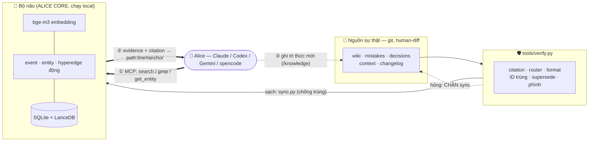

<div align="center">

# 🧠 ALICE CODING

### Biến bất kỳ AI coding agent nào thành cộng sự **kỷ luật · trung thực · có trí nhớ dài hạn** — *không bao giờ quên context.*

[](LICENSE)
[](VERSION)
[](https://github.com/blueberry-sensei/alice-core)
[-2EA043)](https://huggingface.co/BAAI/bge-m3)
[](#-cài-đặt)
[](#-cài-đặt)
[](brain/sync/sync.py)

**[Tổng quan](#-tổng-quan)** · **[Kiến trúc](#️-kiến-trúc--công-nghệ)** · **[Cài đặt](#-cài-đặt)** · **[Dùng hằng ngày](#-dùng-hằng-ngày)** · **[Nâng cấp](#-nâng-cấp)** · **[Roadmap](#️-roadmap)**

</div>

---

## ✨ Tổng quan

AI coding agent rất mạnh, nhưng có một điểm chí mạng: **nó quên**. Hết session là mất ký ức; giữa session thì bị *auto-compact* cắt mất chi tiết; và nếu chỉ dựa vào "rule đủ mạnh + model đủ thông minh để tự nhớ đọc đúng file" thì sớm muộn cũng **sót context** → sửa lại lỗi cũ, phá contract, đi ngược quyết định đã chốt.

**ALICE CODING** giải bài toán đó bằng ba lớp:

1. **Bộ khung kỷ luật (file)** — tách *cách làm việc* (hiến pháp [`ALICE.md`](ALICE.md)) khỏi *kiến thức dự án* (6 trụ cột) khỏi *đặc tả project* ([`ALICE.project.md`](ALICE.project.md)).
2. **Bộ não retrieval ([`brain/`](brain/README.md))** — lớp index **semantic + multi-hop** dựng trên [**ALICE CORE**](https://github.com/blueberry-sensei/alice-core), kéo ra **cả tri thức liên quan *gián tiếp***.
3. **Forcing function ([`tools/verify.py`](tools/verify.py))** — lớp kiểm tra chạy **ngoài** context của model, gắn làm gate của `sync`. Đây là thứ giữ cho hai lớp trên **không degrade âm thầm** khi dùng lâu.

> 🎭 Agent tự định danh là **Alice**, xưng **Nô tài**, gọi bạn là **Bệ hạ**. Một cộng sự tận tụy, thẳng thắn, không nịnh — và không bao giờ "báo xong khi chưa xong".

### Được gì

| Năng lực | Ý nghĩa |
|---|---|
| 🧭 **Không sót context** | Retrieval multi-hop qua *event–entity*, có **tiêu chí dừng** rõ ràng thay vì "query vài lần rồi thôi". |
| 🗣️ **Nhớ ý muốn của bạn** | Trụ cột [`decisions/`](decisions/README.md) ghi sở thích/quyết định của bạn **ngay trong turn** bạn nói ra, không đợi cuối phiên. |
| 🧹 **Không thành bãi rác** | ID ổn định + trạng thái `SUPERSEDED`/`RESOLVED` + bước **prune** — tri thức được *sửa*, không chỉ *chồng thêm*. |
| 🛡️ **Kỷ luật kiểm được bằng máy** | `verify.py` bắt citation chết, trang wiki mồ côi, entry sai format; `sync` **từ chối chạy** nếu kho hỏng. |
| ⬆️ **Nâng cấp 1 lệnh** | `update.py` tách bạch template ↔ tri thức của bạn — pull bản mới không đụng một dòng nào bạn viết. |
| 🔒 **Local-first & riêng tư** | Embedding `bge-m3` chạy **local**; dữ liệu não nằm trên máy bạn (SQLite + LanceDB). |
| 🤝 **Đa agent** | Claude Code, Codex, Gemini, opencode… đều nói **MCP** → cùng một bộ não. Không hook riêng agent nào. |

---

## 🧠 Ba tiêu chí "khi vibe"

<div align="center">

| | Tiêu chí | Cơ chế | Ép bằng gì |
|:-:|---|---|---|
| **A** | **Tự động nạp ký ức** | Đầu task query não (MCP) + in *"ký ức đã nạp"* kèm số tool call & citation | proof-of-load + tiêu chí dừng |
| **B** | **Sống sót qua auto-compact** | Sau khi bị tóm tắt → tự *rehydrate* từ file + re-query não | checkpoint digest có mục "đọc lại từ đây" |
| **C** | **Tự chủ động cải thiện** | Ghi `decisions`/`mistakes` **theo turn**; cuối task distill → prune → sync | **`verify.py` làm gate của `sync.py`** |

</div>

Điểm mấu chốt: A/B/C đều là chỉ dẫn *nằm trong context* → đều có thể bị auto-compact xoá mất. Nên lớp cuối cùng phải sống **ngoài** context. Đó là `verify.py`, và nó chặn `sync` — chỗ nghẽn bắt buộc (không sync thì não không có tri thức mới). Kỷ luật thành bắt buộc mà vẫn **portable 100%**.

---

## 🏛️ Kiến trúc & Công nghệ

### Nguyên tắc: **index dẫn xuất** (file = source-of-truth)



- **Đọc qua MCP, ghi qua sync.** Agent chỉ *truy vấn* não (8 tool read-only). Việc *ghi* đi qua [`sync.py`](brain/sync/sync.py) — giữ map `file → document_id + sha256` nên **không bao giờ tạo document trùng**.
- **Chỉ nuốt thư mục tri thức** đã chưng cất, **không** index source code thô.
- **Kho hỏng thì không cho sync** — nhồi trang mồ côi/citation chết vào não làm recall *tệ đi*.

### Vì sao không dùng RAG thường

Dense RAG chấm điểm chunk theo độ giống vector → hay sót đúng thứ chỉ liên quan **gián tiếp**. [ALICE CORE](https://github.com/blueberry-sensei/alice-core) làm khác: mỗi chunk sinh **1 event** (một mệnh đề có nghĩa trọn vẹn) + **N entity** (điểm để mở rộng); lúc query, các event **join qua entity chung** để dựng *hyperedge động* → bung sang tri thức mà truy vấn gốc không hề nhắc tới.

Đúng thứ ta cần: hỏi "sửa hàm A" mà vẫn kéo ra được quyết định cũ về module B chỉ vì cả hai cùng chạm một entity.

### Sáu trụ cột tri thức

| Trụ cột | Trả lời câu hỏi | Cách chống phình |
|---|---|---|
| [`wiki/`](wiki/README.md) | Hệ thống **đang** ra sao? | sửa tại chỗ + tách trang |
| [`mistakes/`](mistakes/README.md) | Alice **đã sai** gì? | `RESOLVED` / `SUPERSEDED` + gộp |
| [`decisions/`](decisions/README.md) | Bệ hạ **muốn** thế nào? | `SUPERSEDED` / `RETIRED` |
| [`context/`](context/README.md) | Phiên đó **diễn ra** thế nào? | 1 phiên 1 file, archive digest cũ |
| [`changelog/`](changelog/README.md) | Code **đã đổi** gì? | append-only có chủ đích, giữ compact |
| [`sub-agents/`](sub-agents/README.md) | Khi nào **giao việc** cho agent phụ? | (không phải kho tri thức) |

### Bộ công nghệ

| Lớp | Công nghệ |
|---|---|
| Retrieval engine | **ALICE CORE** / `alicecore` (MIT, Python 3.11+) |
| Embedding (local) | **BAAI/bge-m3** phục vụ qua Ollama (OpenAI-compatible) |
| LLM (extract/rerank) | Cấu hình trong app — **AIStudio/Gemini free**, OpenRouter, hoặc local |
| Lưu trữ | SQLite + LanceDB (bind-mount, gitignore) |
| Giao tiếp agent | **MCP** (Streamable HTTP) + REST |
| Orchestration | **Docker Compose** (ALICE api+web + embedding + checklist) |
| Tooling | **Python, chỉ thư viện chuẩn** — `tools/verify.py`, `tools/update.py`, `brain/sync/sync.py` |

---

## 🚀 Cài đặt

> **TL;DR — 3 bước là có app xài.**
>
> **🪟 Windows / PowerShell:**
> ```powershell
> git clone https://github.com/blueberry-sensei/alice-coding.git knowledge; Remove-Item -Recurse -Force knowledge\.git
> ```
> ```powershell
> powershell -File knowledge\brain\stack\brain-up.ps1
> ```
>
> **🍎🐧 macOS / Linux / WSL:**
> ```bash
> git clone https://github.com/blueberry-sensei/alice-coding.git knowledge && rm -rf knowledge/.git
> ```
> ```bash
> bash knowledge/brain/stack/brain-up.sh
> ```
> Trên **WSL**, launcher sẽ **stream log và GIỮ chạy** — **đừng đóng cửa sổ đó**. *(mac/Linux/Docker Desktop: chạy xong tự thoát.)*
>
> Rồi mở `http://localhost:3000` → **Settings → Models** → dán key Gemini. **Xong.**
>
> Để agent dùng não: chạy **INITIALIZATION** (Bước 4) — agent tự nạp kiến thức repo + **tự cắm MCP**, rồi bạn **restart agent**.

> ⚠️ **Xoá `knowledge/.git` sau khi clone** rồi **commit `knowledge/` vào repo project của bạn**. Tri thức là tài sản của project. Từ v2, nâng cấp template đi qua [`tools/update.py`](tools/update.py) chứ **không** qua `git pull` — nên không cần repo lồng repo nữa.

### 🟢 Có Node? Dùng lệnh npm cho gọn

Lớp vỏ npm **không có dependency nào** — nó chỉ dò môi trường (Docker Desktop / Docker CE trong WSL / mac / Linux), tìm đúng Python, rồi gọi launcher + script Python thật. Không có Node vẫn dùng được 100% bằng lệnh gốc.

```bash
npm install
```

```bash
npm run doctor
```

```bash
npm run brain
```

```bash
npm run uninstall
```

| npm | Lệnh gốc tương đương |
|---|---|
| `npm run doctor` | *(không có — chỉ npm mới có)* |
| `npm run brain` | `powershell -File brain\stack\brain-up.ps1` · `bash brain/stack/brain-up.sh` |
| `npm run brain:status` / `:logs` / `:down` | `docker compose --env-file .env ps` / `logs -f` / `down` |
| `npm run uninstall` | Gỡ container, network, image local, cấu hình và dữ liệu runtime của `alice-brain`; giữ file tri thức đã commit. |
| `npm run verify` / `verify:fix` | `python tools/verify.py [--fix]` |
| `npm run sync` / `sync:rebuild` | `python brain/sync/sync.py [--rebuild]` |
| `npm run update` / `update:check` | `python tools/update.py [--check]` |
| `npm run mcp` | *(in sẵn lệnh cắm MCP đúng môi trường của bạn)* |

**`npm run doctor` là lệnh nên chạy đầu tiên và mỗi khi thấy lạ** — nó nói thẳng cái gì thiếu và sửa thế nào.

### Yêu cầu
- **Docker** (Docker Desktop, hoặc Docker Engine/CE trong WSL) đang chạy.
- **Git**, **Python 3.9+**, và ~**6–8GB** trống (image app + model `bge-m3`).
- *(Tuỳ chọn)* **Node 18+** nếu muốn dùng lệnh `npm run …`.
- Một **API key LLM free** — khuyên [AIStudio/Gemini](https://aistudio.google.com/apikey).
- *(Tùy chọn, để chạy INITIALIZATION)* **Claude Desktop** hoặc **Codex Desktop**.

### Bước 1 — Lấy source (vào repo project của bạn)

🪟 **PowerShell:**
```powershell
git clone https://github.com/blueberry-sensei/alice-coding.git knowledge; Remove-Item -Recurse -Force knowledge\.git
```

🍎🐧 **macOS / Linux / WSL:**
```bash
git clone https://github.com/blueberry-sensei/alice-coding.git knowledge && rm -rf knowledge/.git
```

### Bước 2 — Khởi động stack bằng **1 lệnh** (chọn đúng môi trường)

<details open>
<summary><b>🪟 Windows + Docker Desktop</b></summary>

```powershell
powershell -File knowledge\brain\stack\brain-up.ps1
```
Launcher tự clone [`alice-brain`](https://github.com/blueberry-sensei/alice-brain) + [`alice-core`](https://github.com/blueberry-sensei/alice-core), build, pull model. Không cần sửa `.env`.
</details>

<details>
<summary><b>🐧 Windows + WSL (Docker Engine/CE trong WSL)</b></summary>

Docker chạy *trong* WSL → mở terminal **WSL** và chạy script `.sh` (không dùng PowerShell):
```bash
bash knowledge/brain/stack/brain-up.sh
```
> ⚠️ **GIỮ cửa sổ WSL này MỞ** khi dùng brain — đóng hết cửa sổ WSL thì WSL tự tắt → docker + brain tắt.
> 💡 Hiệu năng: nên để repo trong filesystem WSL (`~/…`) thay vì `/mnt/d/…`.
</details>

<details>
<summary><b>🍎 macOS</b></summary>

```bash
bash knowledge/brain/stack/brain-up.sh
```
</details>

### Bước 3 — Cấu hình LLM ngay trên app
Mở **http://localhost:8090** — trang checklist hướng dẫn từng bước. Tóm tắt:
1. Mở **http://localhost:3000** → nhập tên tạo danh tính (vd `Alice`).
2. **Settings → Models** → dán key **AIStudio/Gemini** (hoặc OpenRouter). ✅ *Embedding `bge-m3` đã chạy sẵn.*
3. Tạo 1 source thử + thêm text + search → xác nhận embedding & LLM chạy.

### Bước 4 — Chạy INITIALIZATION (agent tự làm phần còn lại)
Mở agent (Codex/Claude) trong repo project và bảo:
> *"Đọc và chạy `knowledge/INITIALIZATION.md`."*

Agent sẽ tự: **tinh luyện** repo → điền các file instance (`ALICE.project.md`, `wiki/ROUTER.md`, các trụ cột) → chạy `verify` → nạp vào não → **tự ghi config MCP `brain`** → in ra **vibe base-prompt**. Việc duy nhất của bạn sau đó: **restart agent**.

<details>
<summary>Cắm MCP thủ công (chỉ khi cần — INITIALIZATION đã tự làm)</summary>

stdio bridge — thêm vào config MCP của agent:
- **Docker CE trong WSL** + agent Windows: `command:"wsl"`, `args:["-e","docker","exec","-i","alice-brain-api-1","python","-m","sag_api.mcp.server"]`
- **Docker Desktop / Linux / agent trong WSL:** `command:"docker"`, `args:["exec","-i","alice-brain-api-1","python","-m","sag_api.mcp.server"]`
- Hoặc HTTP: `http://localhost:8000/mcp/` + Bearer token. Chi tiết: [`brain/SETUP.md`](brain/SETUP.md) & [`sub-agents/mcp.md`](sub-agents/mcp.md).
</details>

<details>
<summary><b>🛟 Gỡ rối nhanh</b></summary>

| Triệu chứng | Xử lý |
|---|---|
| Document **FAILED** khi extract | LLM chưa cấu hình / không phát JSON schema → dùng AIStudio-Gemini. |
| Search rỗng / embedding lỗi | `docker compose logs embedding`; kiểm model: `docker compose exec embedding ollama list`. |
| `brain-up` báo `ALICE_APP_PATH sai` | Chỉ xảy ra khi bạn tự đặt biến đó trong `.env`. Bỏ nó đi để launcher tự clone, hoặc trỏ đúng thư mục chứa `apps/api`. |
| `sync.py` **dừng, báo ERROR** | Kho tri thức hỏng — đó là gate làm đúng việc. `python tools/verify.py` xem chi tiết, `--fix` nắn citation trôi dòng. |
| `sync.py` báo **sai schema state** | `python brain/sync/sync.py --rebuild` (an toàn, file là source-of-truth). |
| Đổi embedding model | `python brain/sync/sync.py --rebuild`. |
| Lỗi `\r` khi chạy `.sh` trong WSL | Đã có `.gitattributes` ép LF; nếu vẫn dính, `dos2unix` file `.sh`. |

Chi tiết vận hành: [`brain/stack/README.md`](brain/stack/README.md).
</details>

---

## 🧭 Dùng hằng ngày

Sau khi init, mỗi task chỉ cần dán **vibe base-prompt** (INITIALIZATION in ra) rồi điền việc ở `## NHIỆM VỤ`. Alice sẽ tự:

**[A]** nạp ký ức đầu task → làm theo [quy trình 5 bước](ALICE.md#4-quy-trình-5-bước-tự-hành) → **[C]** ghi `decisions`/`mistakes` **ngay trong turn** phát sinh, cuối task thì distill + prune + verify + sync; và **[B]** tự rehydrate nếu bị auto-compact.

Hai lệnh bạn nên biết:

```bash
python knowledge/tools/verify.py --fix    # kiểm & nắn kho tri thức
python knowledge/brain/sync/sync.py       # đồng bộ file → não (tự verify trước)
```

📚 Đọc thêm: [`ALICE.md`](ALICE.md) (hiến pháp) · [`ALICE.project.md`](ALICE.project.md) (đặc tả project) · [`brain/RETRIEVAL.md`](brain/RETRIEVAL.md) (giao thức query) · [`brain/KNOWLEDGE.md`](brain/KNOWLEDGE.md) (routine tự cải thiện) · [`UPGRADE.md`](UPGRADE.md).

---

## ⬆️ Nâng cấp

```bash
python knowledge/tools/update.py
```

Một lệnh, không conflict. Ranh giới sở hữu là tuyệt đối:

| Chủ sở hữu | Gồm gì | `update` làm gì |
|---|---|---|
| **TEMPLATE** | `ALICE.md`, `INITIALIZATION.md`, `tools/`, `brain/`, `sub-agents/`, các `README`/`_TEMPLATE` | **ghi đè** (nếu bạn chưa sửa tay) |
| **INSTANCE** | `ALICE.project.md`, `wiki/ROUTER.md`, `wiki/<module>.md`, `mistakes/LOG.md`, `decisions/LOG.md`, `context/`, `changelog/`, `brain.config` | **không bao giờ chạm** |

Đã sửa tay một file template? `update` **không** ghi đè — nó để bản mới ở `<file>.new` cho bạn gộp. Chi tiết + rollback + hướng dẫn cho người bảo trì: [`UPGRADE.md`](UPGRADE.md) · [`MIGRATIONS.md`](MIGRATIONS.md).

---

## 📂 Cấu trúc repo

```
ALICE CODING/  (clone vào ./knowledge của project)
├── VERSION                ← semver của template (đường nâng cấp)
├── ALICE.md               ← [TEMPLATE] Hiến pháp: cách Alice làm việc
├── ALICE.project.md       ← [INSTANCE] Đặc tả project: stack, convention, high-risk
├── INITIALIZATION.md      ← [TEMPLATE] Bootstrap: quét repo → tinh luyện → dựng não
├── UPGRADE.md · MIGRATIONS.md   ← [TEMPLATE] Đường nâng cấp
├── tools/
│   ├── verify.py          ← forcing function: kiểm kho tri thức (gate của sync)
│   ├── update.py          ← nâng cấp template, không đụng tri thức project
│   └── manifest.json      ← ranh giới template ↔ instance (+ sha256)
├── brain/                 ← 🧠 Bộ não
│   ├── README · SETUP · RETRIEVAL · SYNC · KNOWLEDGE
│   ├── sync/sync.py       ← file→não, chống trùng, gate verify, --rebuild
│   └── stack/             ← Docker 1-lệnh: compose + launcher + checklist
├── wiki/     README(T) · ROUTER.md(I) · <module>.md(I)
├── mistakes/ README(T) · LOG.md(I)     ← ID M-XXXX + trạng thái
├── decisions/README(T) · LOG.md(I)     ← ID D-XXXX — ý muốn của Bệ hạ
├── context/  README(T) · INDEX.md(I) · <digest>.md(I)
├── changelog/README(T) · <module>.md(I)
└── sub-agents/            ← [TEMPLATE] ngưỡng delegate + thu hồi bài học
```
`(T)` = template, `update` ghi đè · `(I)` = instance, `update` không chạm.

---

## 🗺️ Roadmap

**v2.1.0** — bộ khung kỷ luật, forcing function và đường nâng cấp đã ổn định.

Đang làm:
- Wrapper `/knowledge` cho Codex · Gemini · opencode
- Benchmark `bge-m3` đối chiếu `Qwen3-Embedding`
- Bản README tiếng Anh

> Gặp lỗi khi cài? Mở issue kèm log service tương ứng — càng cụ thể càng vá nhanh.

---

## 📜 License & Credits

- Mã nguồn: [MIT](LICENSE).
- Retrieval engine: [**ALICE CORE**](https://github.com/blueberry-sensei/alice-core) (MIT).
- Ứng dụng brain: [**ALICE BRAIN**](https://github.com/blueberry-sensei/alice-brain) (MIT).
- Embedding: [BAAI/bge-m3](https://huggingface.co/BAAI/bge-m3).

<div align="center"><sub>Made with 🤍 for những phiên vibe coding không mất trí nhớ.</sub></div>
