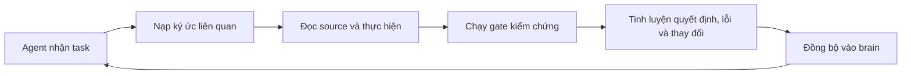
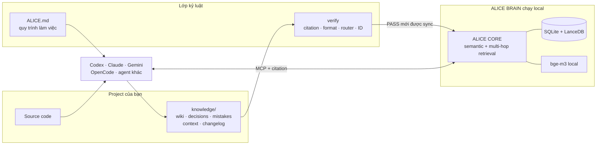

<div align="center">


# ALICE CODING

### Bộ nhớ dài hạn và hệ điều hành làm việc cho AI coding agent.

**Một sản phẩm của [Blueberry Sensei](https://github.com/blueberry-sensei).**

[](LICENSE)
[](VERSION)
[](#alice-core-khác-rag-thường-ở-đâu)
[](https://huggingface.co/BAAI/bge-m3)
[](#4-cài-đặt)
[](#4-cài-đặt)

**[Alice là gì?](#1-alice-coding-là-gì)** ·
**[Giải quyết vấn đề gì?](#2-alice-coding-giải-quyết-vấn-đề-gì)** ·
**[Có gì bên trong?](#3-vì-sao-alice-coding-làm-được-chuyện-đó)** ·
**[Cài đặt](#4-cài-đặt)** ·
**[Lệnh vận hành](#5-cập-nhật-và-vận-hành)**

</div>

---

## 1. Alice Coding là gì?

**Alice Coding là một bộ khung giúp AI coding agent làm việc như một cộng sự lâu năm, thay vì
một người mới mất trí nhớ sau mỗi cuộc trò chuyện.**

Nó không phải model mới. Nó cũng không thay thế Codex, Claude Code, Gemini CLI hay OpenCode.
Alice Coding đứng **xung quanh** những agent đó và cung cấp ba thứ chúng thường thiếu:

1. **Một bộ nhớ dài hạn thuộc về project** — quyết định, lỗi từng gặp, kiến trúc, quy ước và bối
   cảnh quan trọng được giữ lại qua nhiều ngày, nhiều session và nhiều agent.
2. **Một quy trình làm việc có kỷ luật** — đọc trước khi sửa, kiểm chứng trước khi báo xong, ghi
   lại bài học ngay khi nó xuất hiện.
3. **Một bộ não tìm đúng ký ức khi cần** — agent không phải nhét toàn bộ lịch sử vào prompt; nó
   chỉ lấy phần có liên quan, kèm đường dẫn để kiểm lại.

Alice có tính cách riêng: thẳng thắn, không nịnh, không “báo xong cho đẹp”. Nhưng phần quan trọng
không phải cách xưng hô. Phần quan trọng là **kỷ luật đó có cơ chế máy móc đứng phía sau**, không
chỉ là vài dòng prompt mong model tự giác.

---

## 2. Alice Coding giải quyết vấn đề gì?

### Vibe coding nhanh, nhưng càng lâu càng dễ “thối não”

Một project vibe coding thường bắt đầu rất đã:

- Ngày đầu: agent viết nhanh, context còn ít, mọi thứ trông thông minh.
- Tuần sau: quyết định nằm rải rác trong chat; agent mới không biết vì sao code được viết như vậy.
- Vài tháng sau: cùng một bug bị sửa lại, contract cũ bị phá, một workaround bị tưởng là thiết kế
  chính thức, còn người dùng phải kể lại toàn bộ lịch sử từ đầu.

Đổi sang model lớn hơn chỉ giúp agent **suy luận tốt hơn với những gì nó đang thấy**. Nó không thể
nhớ một quyết định chưa được đưa vào context, và cũng không thể kiểm chứng một điều chưa từng được
ghi lại.

Hậu quả quen thuộc:

| Bạn nhìn thấy | Vấn đề thật phía dưới |
|---|---|
| “Sao nó lại hỏi câu này nữa?” | Ký ức chỉ nằm trong chat cũ. |
| “Hôm qua sửa rồi, hôm nay lại phá.” | Không có bản ghi quyết định và sai lầm dùng chung. |
| “Prompt dài kinh khủng mà vẫn sót.” | Nạp thật nhiều chữ không đồng nghĩa nạp đúng bằng chứng. |
| “Agent bảo xong nhưng chạy thật thì chết.” | Không có gate độc lập buộc nó verify. |
| “Mỗi agent hiểu project một kiểu.” | Claude, Codex, Gemini chưa dùng chung một nguồn sự thật. |

### Alice biến lịch sử rời rạc thành một vòng lặp có trí nhớ



Vòng lặp này giải quyết vấn đề theo cách rất đời thường:

- **Trước khi làm:** Alice tra lại những gì project đã biết.
- **Trong khi làm:** Alice theo luật của project và giữ bằng chứng từ source thật.
- **Trước khi báo xong:** công cụ kiểm tra chạy ngoài context của model.
- **Sau khi làm:** chỉ phần tri thức đáng giữ mới được tinh luyện và đồng bộ.

File Markdown vẫn là nguồn sự thật để con người đọc, review và lưu bằng Git. Brain chỉ là index
dẫn xuất; nếu mất toàn bộ dữ liệu brain, có thể dựng lại từ file.

### Người dùng nhận được gì?

| Năng lực | Lợi ích thực tế |
|---|---|
| **Nhớ quyết định dài hạn** | Không phải kể lại “ta đã chốt gì” ở mỗi session. |
| **Nhớ lỗi từng mắc** | Agent thấy lại nguyên nhân và bằng chứng, không lặp đúng sai lầm cũ. |
| **Sống qua auto-compact** | Context bị nén vẫn có checkpoint và brain để nạp lại. |
| **Dùng chung giữa nhiều agent** | Đổi Codex sang Claude hay gọi sub-agent không làm mất trí nhớ project. |
| **Không biến knowledge thành bãi rác** | Có trạng thái thay thế, giải quyết, retire và quy trình prune. |
| **Không “xong giả”** | Kho tri thức hỏng thì sync bị chặn; runtime chưa chạy thì phải nói là chưa chạy. |

---

## 3. Vì sao Alice Coding làm được chuyện đó?

### Kiến trúc: nguồn sự thật, gate và brain tách riêng



Điểm thiết kế quan trọng:

- **Knowledge là tài sản của project**, nằm cùng code và đọc được bằng mắt thường.
- **Brain không phải nguồn sự thật.** Nó là bản tăng tốc để tìm đúng tri thức.
- **Agent đọc qua MCP, ghi qua file rồi sync.** Không có đường ghi tự do làm brain phình âm thầm.
- **`verify` đứng ngoài context của model.** Agent không thể “quên” gate chỉ vì prompt bị compact.

### ALICE CORE khác RAG thường ở đâu?

Vector search thông thường giỏi tìm đoạn có từ ngữ hoặc ý nghĩa gần câu hỏi. Nhưng trong codebase,
thứ cứu một task nhiều khi lại là quan hệ gián tiếp:

> Hàm đang sửa không nhắc đến chính sách bảo mật, nhưng cả hai cùng liên quan đến một loại token,
> một endpoint hoặc một quyết định kiến trúc cũ.

ALICE CORE tách tri thức thành các **event có nghĩa trọn vẹn** và các **entity liên quan**. Khi
truy vấn, nó có thể mở rộng qua entity chung để tìm thêm sự kiện liên quan, thay vì chỉ lấy vài
chunk gần nhất rồi dừng.

Nói đơn giản: Alice không chỉ hỏi *“đoạn nào giống câu này?”* mà còn hỏi
*“những chuyện nào nối với chuyện này, và nối qua đâu?”*

### Multi-model routing: không đặt cả project lên một API key

Trong **Settings → Models**, người dùng xếp nhiều provider/model theo thứ tự ưu tiên. Chuỗi này
được dùng cho cả đường trả lời và đường trích xuất tri thức.

| Khi provider gặp lỗi | Alice xử lý |
|---|---|
| Timeout hoặc lỗi tạm thời | Thử lại có giới hạn trên cùng provider. |
| `429` hoặc hết quota | Cooldown provider đó rồi chuyển sang provider kế tiếp. |
| Credential/model không dùng được | Loại provider lỗi khỏi lượt chạy thay vì lặp vô ích. |
| Request sai contract | Dừng và báo lỗi thật; không đổi nhà để che bug. |

Embedding là ngoại lệ có chủ đích: **không tự đổi model embedding giữa chừng**. Hai model tạo hai
không gian vector khác nhau; trộn chúng trong một index làm retrieval sai nhưng rất khó phát hiện.
Alice thà fail rõ ràng còn hơn âm thầm làm hỏng dữ liệu.

### Multi-agent: nhiều người làm, một bộ nhớ

Mọi agent hỗ trợ MCP đều có thể tra cùng một brain:

- Codex có thể đọc quyết định do Claude ghi lại.
- Agent chính có thể giao một phần việc cho sub-agent rồi thu hồi kết quả về cùng context.
- Mỗi lần agent gọi tool tri thức đều có actor, câu hỏi, kết quả và citation để truy vết.

**Settings → Sub Agents là registry**, không phải dịch vụ chạy agent hộ. Nó lưu slot
provider/model đã được xác thực; orchestrator vẫn gọi CLI bằng phiên đăng nhập của chính CLI đó.
Credential không được chép vào prompt hay project.

### Telemetry: biết AI đã làm gì và tốn bao nhiêu

**Settings → Telemetry** cho thấy:

- request LLM nào đã chạy, qua model/provider nào;
- token vào/ra, độ trễ, thành công hay thất bại;
- chi phí ước tính khi có bảng giá; chưa biết giá thì ghi **unknown**, không giả vờ bằng `0`;
- agent nào đã tra tri thức, gọi tool gì và lấy những citation nào;
- lần delegate sub-agent nào đã được orchestrator khai báo.

Telemetry được bắt tại lớp gọi model dùng chung, nên không chỉ thấy chat mà còn thấy đường
trích xuất chạy bên trong ALICE CORE. Embedding có usage sink riêng vì không đi qua cùng lớp đó.

### Local-first, nhưng không tự dối mình về quyền riêng tư

- Embedding `bge-m3`, SQLite và LanceDB chạy local trong Docker.
- Mỗi project có `BRAIN_ID`, container, network và volume riêng.
- API key được mã hoá AES-GCM trước khi lưu; khoá gốc nằm ngoài repo.
- Knowledge không gửi đi đâu ngoài provider LLM mà **bạn chủ động cấu hình**.
- Brain là ứng dụng single-user local; không nên mở cổng trực tiếp ra Internet.

### Bộ công nghệ

| Lớp | Công nghệ / vai trò |
|---|---|
| Framework | Markdown + Python standard library |
| Retrieval engine | ALICE CORE, Python 3.11+ |
| Web app | Next.js |
| API | FastAPI |
| Model gateway | LiteLLM + provider chain |
| Embedding | BAAI/bge-m3 qua Ollama, chạy local |
| Dữ liệu | SQLite + LanceDB |
| Agent protocol | MCP (stdio hoặc Streamable HTTP) |
| Runtime | Docker Compose |
| Integrity gate | `verify` + manifest SHA-256 + sync chống trùng |

### Benchmark và bằng chứng

Nói thẳng: **ALICE CODING chưa công bố benchmark retrieval chuẩn hoá** như Recall@K, MRR hay
NDCG trên một dataset public. Vì vậy README này không lấy số của model embedding rồi gọi đó là
“benchmark của Alice”.

Những gì có thể tự kiểm ngay hôm nay:

| Tuyên bố | Cách kiểm |
|---|---|
| Kho tri thức không hỏng cấu trúc | `npm run verify` phải trả `0 ERROR`. |
| File sửa không tạo document trùng | `npm run sync` dùng map file + SHA-256 để update đúng document. |
| Stack thực sự chạy | `npm run brain` chỉ kết thúc thành công khi API healthy. |
| Provider nào fail, vì sao đổi nhà | Xem lịch sử gọi và Telemetry trên app. |
| Hai project không dùng nhầm brain | `npm run brain:list` cho thấy identity, cổng và stack riêng. |
| Template mới không ghi đè tri thức riêng | `npm run update:dry` cho xem trước từng thay đổi. |

Thông số chính thức của riêng `bge-m3` nằm trong
[model card của BAAI](https://huggingface.co/BAAI/bge-m3). Benchmark end-to-end của Alice sẽ chỉ
được công bố khi có dataset, cách chấm và script tái lập công khai.

---

## 4. Cài đặt

### Yêu cầu chung

- Node.js **18+**.
- Git.
- Python **3.9+** cho verify, sync và update.
- Docker đang chạy.
- Khoảng **6–8 GB** trống cho image và model embedding.
- Một API key LLM; embedding local đã được đóng gói sẵn.

> Clone Alice Coding vào thư mục `knowledge/` của project, xoá Git history lồng bên trong, rồi
> commit `knowledge/` cùng project. Từ đó về sau nâng cấp bằng `npm run update`, không dùng
> `git pull` trong `knowledge/`.

### Windows + Docker Desktop

Mở **PowerShell** tại thư mục project:

```powershell
git clone https://github.com/blueberry-sensei/alice-coding.git knowledge
Remove-Item -Recurse -Force knowledge\.git
Set-Location knowledge
npm run doctor
npm run brain
```

Launcher dùng Docker Desktop, tự tạo secret ngoài repo, tự cấp cổng trống và in URL chính xác.
Project đầu tiên thường là `http://localhost:3000`; project tiếp theo có thể dùng cổng khác.

### Windows + WSL + Docker CE

Mở terminal **bên trong WSL**. Nên để project trong filesystem WSL như `~/projects/...`, không đặt
ở `/mnt/c/...` nếu muốn I/O nhanh:

```bash
git clone https://github.com/blueberry-sensei/alice-coding.git knowledge
rm -rf knowledge/.git
cd knowledge
npm run doctor
npm run brain
```

Node phải có trong WSL; launcher có thể tự cài bản local khi thiếu, không cần sudo. Nếu Windows
không mở được `localhost`, dùng URL theo IP distro mà launcher in ở dòng cuối.

### macOS + Docker Desktop

Mở Terminal tại thư mục project:

```bash
git clone https://github.com/blueberry-sensei/alice-coding.git knowledge
rm -rf knowledge/.git
cd knowledge
npm run doctor
npm run brain
```

Docker Desktop phải chạy trước. Launcher sử dụng container Linux giống Windows; dữ liệu brain
nằm trong Docker volume, còn secret nằm trong state directory của user.

### Hoàn tất cấu hình trên app

1. Mở URL launcher vừa in.
2. Vào **Settings → Models**, thêm provider/model và API key.
3. Tạo một source thử để chắc embedding và LLM đều chạy.
4. Mở coding agent trong project và yêu cầu:

> Đọc và chạy `knowledge/INITIALIZATION.md`.

Agent sẽ quét repo, tinh luyện knowledge, chạy gate, sync vào brain và tự cắm MCP. Khi agent yêu
cầu, restart agent một lần để config MCP mới có hiệu lực.

---

## 5. Cập nhật và vận hành

### `update` và `brain` là hai việc khác nhau

| Lệnh | Nó cập nhật gì? | Khi nào dùng? |
|---|---|---|
| `npm run update` | Framework/template trong `knowledge/` | Khi Alice Coding có version mới. |
| `npm run brain` | Image ứng dụng ALICE BRAIN/CORE rồi khởi động stack | Khi muốn chạy brain hoặc lấy app image mới. |

Khi có một bản phát hành đầy đủ, chạy **hai bước riêng**:

```bash
npm run update
npm run brain
```

`update` không khởi động Docker. `brain` không viết lại template. Tách hai việc giúp người dùng
thấy rõ phần nào đang thay đổi và lỗi nằm ở đâu.

### Danh mục lệnh npm

#### Chẩn đoán và vận hành brain

| Lệnh | Ý nghĩa |
|---|---|
| `npm run doctor` | Kiểm Node, Python, Docker, API và sức khoẻ knowledge. |
| `npm run brain` | Dựng hoặc khởi động brain; ở image mode sẽ lấy image ứng dụng mới. |
| `npm run brain:status` | Xem mode, cổng và trạng thái brain của project hiện tại. |
| `npm run brain:list` | Xem mọi brain trên máy. |
| `npm run brain:logs` | Theo dõi log stack. |
| `npm run brain:restart` | Khởi động lại stack đang có. |
| `npm run brain:down` | Tắt stack nhưng giữ dữ liệu. |
| `npm run brain:pull` | Kéo lại model embedding `bge-m3`. |

#### Knowledge

| Lệnh | Ý nghĩa |
|---|---|
| `npm run verify` | Kiểm format, citation, router, ID và các bất biến của knowledge. |
| `npm run verify:fix` | Nắn những lỗi an toàn có thể sửa tự động, như citation trôi dòng. |
| `npm run sync` | Verify rồi đồng bộ file knowledge vào brain. |
| `npm run sync:rebuild` | Dựng lại toàn bộ index từ file source-of-truth. |
| `npm run sync:no-verify` | Bỏ gate verify; chỉ dành cho chẩn đoán có chủ đích, không dùng hằng ngày. |

#### Nâng cấp

| Lệnh | Ý nghĩa |
|---|---|
| `npm run update:check` | Kiểm tra có version mới hay không. |
| `npm run update:dry` | Xem trước update sẽ thay đổi file nào. |
| `npm run update` | Áp dụng template mới nhưng không đụng file instance của project. |
| `npm run mcp` | In config MCP; INITIALIZATION thường tự chạy lệnh này cho agent. |

#### Lệnh phá huỷ — đọc kỹ trước khi chạy

| Lệnh | Điều bị xoá |
|---|---|
| `npm run uninstall:yes` | Runtime Docker, volume, image và build cache; **giữ** knowledge. |
| `npm run uninstall:keep-cache` | Như trên nhưng giữ build cache dùng chung. |
| `npm run reset:yes` | Xoá knowledge instance và kéo lại template trắng. |

### Tình huống nào dùng lệnh nào?

| Tình huống | Chuỗi hành động |
|---|---|
| Cài lần đầu | `npm run doctor` → `npm run brain` |
| Alice Coding có version mới | `npm run update:check` → `npm run update:dry` → `npm run update` → `npm run brain` |
| Chỉ app image được publish lại | `npm run brain` |
| Brain có dấu hiệu lạ | `npm run doctor` → `npm run brain:status` → `npm run brain:logs` |
| Citation bị trôi sau khi sửa source | `npm run verify:fix` → `npm run sync` |
| Đổi embedding model hoặc index sai schema | `npm run sync:rebuild` |
| Muốn tắt tạm thời | `npm run brain:down` |
| Muốn gỡ app nhưng giữ tri thức | `npm run uninstall:yes` |
| Muốn làm lại project knowledge từ đầu | `npm run reset:yes` |

> Trên PowerShell, không dùng dạng `npm run x -- --flag` cho cờ không có giá trị; shim `npm.ps1`
> có thể nuốt token `--`. Alice Coding đã cung cấp script riêng như `uninstall:yes`,
> `reset:yes` và `sync:no-verify`.

---

## 6. Dùng hằng ngày

Sau INITIALIZATION, người dùng chỉ cần đưa task. Alice sẽ tự:

1. nạp ký ức liên quan;
2. đọc source và contract thật;
3. thực hiện thay đổi;
4. verify theo rủi ro;
5. cập nhật knowledge và sync khi cần.

Các tài liệu chính:

- [`ALICE.md`](ALICE.md) — hiến pháp làm việc của agent.
- [`ALICE.project.md`](ALICE.project.md) — đặc tả riêng của project.
- [`INITIALIZATION.md`](INITIALIZATION.md) — quy trình bootstrap lần đầu.
- [`brain/RETRIEVAL.md`](brain/RETRIEVAL.md) — cách agent truy vấn brain.
- [`brain/KNOWLEDGE.md`](brain/KNOWLEDGE.md) — cách tinh luyện và bảo trì knowledge.
- [`brain/TELEMETRY.md`](brain/TELEMETRY.md) — token, cost và dấu vết agent.
- [`UPGRADE.md`](UPGRADE.md) — chi tiết nâng cấp và rollback.

<details>
<summary><b>Cấu trúc thư mục knowledge</b></summary>

```text
knowledge/
├── ALICE.md
├── ALICE.project.md
├── INITIALIZATION.md
├── wiki/
├── decisions/
├── mistakes/
├── context/
├── changelog/
├── sub-agents/
├── brain/
└── tools/
```

- `wiki/`: hệ thống hiện hoạt động thế nào.
- `decisions/`: người dùng đã chốt điều gì.
- `mistakes/`: lỗi nào từng xảy ra và bằng chứng sửa.
- `context/`: checkpoint của các phiên làm việc.
- `changelog/`: thay đổi đáng nhớ theo module.
- `sub-agents/`: luật delegate và thu hồi kết quả.

</details>

<details>
<summary><b>Gỡ rối nhanh</b></summary>

| Triệu chứng | Hành động |
|---|---|
| API hoặc web không healthy | `npm run brain:logs` |
| Không biết brain đang dùng cổng nào | `npm run brain:status` |
| Document extract thất bại | Kiểm **Settings → Models**, lịch sử gọi và Telemetry. |
| Sync bị chặn | `npm run verify`, sửa lỗi thật rồi sync lại. |
| Search rỗng sau khi đổi embedding | `npm run sync:rebuild` |
| Model embedding chưa tải xong | `npm run brain:pull` |

Log chi tiết nằm trong `brain/.logs/`. Xem thêm [`brain/stack/README.md`](brain/stack/README.md).

</details>

---

## 7. Roadmap

- Benchmark retrieval end-to-end có dataset và script tái lập công khai.
- README tiếng Anh.
- Trải nghiệm cài đặt và cấu hình agent đơn giản hơn.
- Tiếp tục mở rộng telemetry mà không biến brain thành hệ thống theo dõi người dùng.

---

## 8. Cảm ơn và License

ALICE CODING được xây dựng bởi **Blueberry Sensei** cho những người muốn giữ tốc độ của vibe
coding nhưng không chấp nhận đánh đổi trí nhớ, tính đúng đắn và quyền kiểm soát project.

Cảm ơn các dự án và giao thức nền tảng đã làm sản phẩm này khả thi:

- [Model Context Protocol](https://modelcontextprotocol.io/) — giao thức kết nối agent với brain.
- [BAAI/bge-m3](https://huggingface.co/BAAI/bge-m3) — embedding đa ngôn ngữ chạy local.
- Docker, Python, FastAPI, Next.js, LiteLLM, SQLite, LanceDB và Ollama.

Repo `alice-coding` được phát hành theo giấy phép [MIT](LICENSE). Dependency và model đi kèm tuân
theo giấy phép riêng của từng dự án.

<div align="center">

**Made by Blueberry Sensei — for vibe coding that remembers.**

</div>
